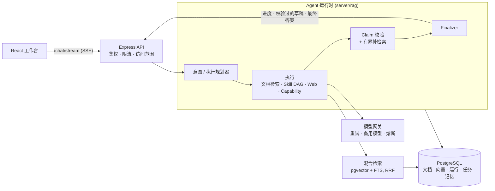

<div align="center">

# Luc1ferxx Archive RAG

**可信文档智能体：上传 PDF 后提问、对比、审查，每个结论都能追溯到页级证据。**

<p>
  
  
  
  
  
</p>

[快速开始](#快速开始) · [设计要点](#设计要点) · [架构](#架构) · [真实模型结果](#真实模型结果) · [文档](#文档)

</div>

## 它能做什么

- 在选中文档或整个工作区里提问，回答带页码、摘录和来源文件。
- 多文档结构化对比：每份文档独立检索，数值绑定到出处，能识别"没有实质差异"。
- 证据不足时补检索、请求澄清或明确拒答，而不是编一个看起来合理的答案。
- 后台 Agent 任务、审批门和运行记录，进程崩溃后可以恢复。
- 可作为 MCP server 给其他 Agent 调用，也能不连数据库单机运行。

## 设计要点

- **模型只提议，运行时做决定。** 规划器只能在白名单里选意图、步骤和 Skill；权限、文档范围、预算、审批和并发由运行时决定。自定义 Skill 阶段是带类型的执行图（DAG），校验器对整张图要么接受、要么拒绝，不会只执行一半。
- **先校验，再输出。** 每条结论都必须由它引用的证据支持：默认用词法规则，可选一个权限受限的 LLM 评审；没有支持的内容由 finalizer 删除。流式接口只推送已通过校验的整句。
- **持久、可恢复。** 运行、步骤和检查点存在 PostgreSQL，用版本号 CAS 挡住过期的 worker；有副作用的步骤不会被自动重放。
- **一切有上限。** 补检索最多一轮、重规划最多一次；每次运行有调用次数和 token / 成本 / 时长上限，超限时降级而不是报错。
- **模型调用有防护。** 退避重试、遵守 Retry-After、超时重试、切换备用模型、并发上限、熔断；规划器用 strict JSON Schema 约束输出。
- **可观测、可评测。** OpenTelemetry GenAI trace 能看到每个规划器、Skill 和模型调用的耗时与 token；效果结论来自真实模型评测，并附带置信区间、对照组和故障注入。

## 架构


```mermaid
flowchart LR
  UI["React 工作台"] -->|"/chat/stream (SSE)"| API["Express API<br/>鉴权 · 限流 · 访问范围"]
  API --> Plan

  subgraph Agent["Agent 运行时 (server/rag)"]
    Plan["意图 / 执行规划器"] --> Exec["执行<br/>文档检索 · Skill DAG · Web · Capability"]
    Exec --> Check["Claim 校验<br/>+ 有界补检索"]
    Check --> Final["Finalizer"]
  end

  Exec --> Gateway["模型网关<br/>重试 · 备用模型 · 熔断"]
  Exec --> Retrieval["混合检索<br/>pgvector + FTS, RRF"]
  Final -->|"进度 · 校验过的草稿 · 最终答案"| API
  Agent --> PG[("PostgreSQL<br/>文档 · 向量 · 运行 · 任务 · 记忆")]
  Retrieval --> PG
```

| 位置 | 内容 |
| --- | --- |
| `server/app.js`、`server/routes/` | 组合根和按功能拆分的路由，入参用 zod 校验 |
| `server/rag/agent*.js` | 规划、执行计划、Skill DAG、文档循环、收尾、运行记录与恢复 |
| `server/rag/self-check/` | Claim 校验（词法规则、数字归一化、LLM 评审） |
| `server/rag/openai*.js`、`model-call-guard.js` | 模型网关：重试、备用模型、并发上限、熔断、流式输出 |
| `server/evaluation/` | 评测脚本和质量门禁 |
| `src/` | React 工作台 |

细节见 [docs/agent-rag.md](docs/agent-rag.md)。

## 快速开始

```bash
npm install && (cd server && npm install)
cp .env.example .env && cp server/.env.example server/.env
docker compose up -d   # PostgreSQL 16 + pgvector，端口 5432
npm run dev            # 前端 http://localhost:3000，后端 http://localhost:5001
```

`server/.env` 里至少设置 `OPENAI_API_KEY`；`POSTGRES_DATABASE_URL` 默认已经指向上面的容器。检查启动状态：`curl http://localhost:5001/health`。

**不花钱，用本地模型：** 安装 [Ollama](https://ollama.com)，执行 `ollama pull qwen2.5:7b` 和 `ollama pull nomic-embed-text`，再在 `server/.env` 里设置：

```env
OPENAI_API_KEY=ollama
OPENAI_BASE_URL=http://127.0.0.1:11434/v1
OPENAI_CHAT_MODEL=qwen2.5:7b
OPENAI_EMBEDDING_MODEL=nomic-embed-text
RAG_EMBEDDING_DIMENSIONS=768
```

没有 PostgreSQL 时可以设 `DOCCOMPARE_STANDALONE=1`，改用文件存储。其他可选开关：`RAG_CLAIM_JUDGE=llm` 打开 LLM 评审，`OTEL_TRACING_ENABLED=true` 导出 trace。完整配置见 [docs/configuration.md](docs/configuration.md)。

## 常用命令

| 命令 | 作用 |
| --- | --- |
| `npm run dev` | 同时启动前端和后端 |
| `npm test` / `cd server && npm test` | 前端测试（111 个）/ 后端测试（1742 个，其中 2 个需要 PostgreSQL，没有数据库时跳过） |
| `npm run build` | 构建前端 |
| `cd server && npm run verify:quality` | 用真实模型跑端到端检查：问答、对比、拒答、跨进程持久化 |
| `cd server && npm run eval:trajectory` | 检查 Agent 轨迹：Skill 选择、补检索、澄清、访问范围、预算 |
| `cd server && npm run eval:llm-resilience` | 故障注入：限流、503、挂起、主模型宕机、服务饱和（不需要模型） |
| `cd server && npm run trace:demo` | 跑一次请求并打印它的 trace 树 |
| `cd server && npm run quality:current` | PR 质量门禁 |

全部评测命令和门禁规则见 [docs/evaluation.md](docs/evaluation.md)。

## 真实模型结果

以下数字来自本地 7B 模型（`qwen2.5:7b` + `nomic-embed-text`），不是 GPT 级模型，也没有生产流量；评测集小，标了"显著"的才算差异显著。命令和版本见 [CURRENT-TRUTH.md](server/docs/interview/CURRENT-TRUTH.md)。

| 方面 | 结果 |
| --- | --- |
| 检索（48 条用例，Recall@5） | hybrid 0.71，dense 0.65，BM25 0.66；全量差异不显著，tuning 子集上 hybrid 显著优于 BM25 |
| 端到端（`verify:quality`） | 18/18（修了两个把正确对比答案判错的校验器 bug） |
| 规划器约束解码 | 降级率 56% → 8%，用例通过率 47% → 80%，耗时不变 |
| 模型调用容错 | 限流下成功率 79% → 100%；主模型宕机时 0% → 100%，熔断后 p50 从 2.6s 降到 24ms |
| Agent 回答率 | 合同题 3/21 → 14/21（打开 LLM 评审后，14 个全对，p50 多约 0.8s） |

## 文档

| 文档 | 内容 |
| --- | --- |
| [docs/agent-rag.md](docs/agent-rag.md) | Agent 闭环、Skill 与 DAG、校验、流式、预算、trace、调用链、优化路线 |
| [docs/evaluation.md](docs/evaluation.md) | 评测命令、质量门禁、所有改前 / 改后数字 |
| [docs/configuration.md](docs/configuration.md) | 环境变量 |
| [docs/development.md](docs/development.md) | API、目录结构、工程化基线、开发约束 |
| [docs/unified-agent-dag-migration.md](docs/unified-agent-dag-migration.md) | 全阶段统一图（已冻结）的设计记录 |
| [server/docs/interview/](server/docs/interview/) | 面试材料：数字出处、3 分钟讲述、故障故事、高频追问 |

## 当前限制

- 真实模型数字只来自本地 7B；没有人工标注的黄金集，LLM 评审只在构造的对照集上校准过，而且是同一个模型检查自己，所以默认关闭。
- 默认的词法校验对改写很严格：不开评审时，Agent 常常转为请用户澄清。
- 熔断、并发上限和评审缓存只存在进程内存里，多实例部署时各自计数；租户隔离只在应用层做，数据库还没有行级安全。
- 只读 PDF 文本层，没有 OCR、表格和版面解析；提示注入只有设计层防御，还没有对抗测试集。
- Typed DAG 只覆盖自定义 Skill 阶段，外层的文档、Web、内置 Skill 仍按固定顺序执行。
