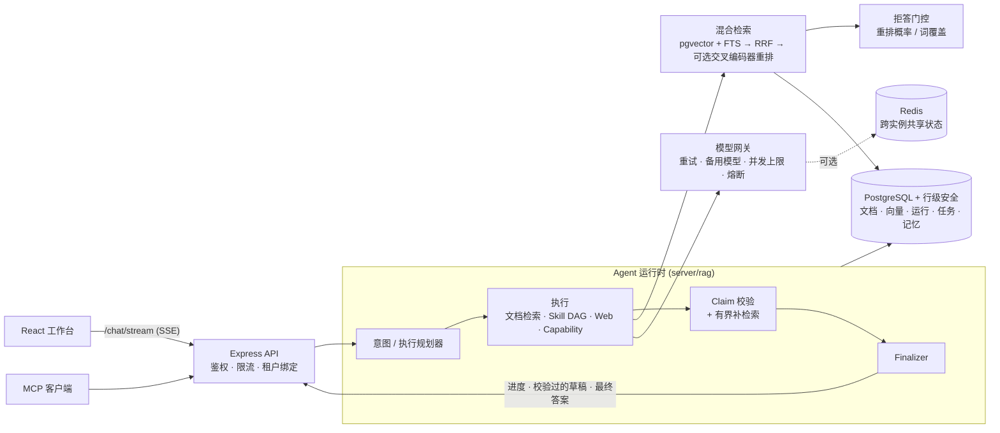

<div align="center">

# Luc1ferxx Archive RAG

**可信文档智能体：上传 PDF 后提问、对比、审查，每个结论都能追溯到页级证据；证据不够就补检索、澄清或拒答。**

<p>
  <a href="https://github.com/luc1ferxx/Luc1ferxx_Archive_RAG/actions/workflows/quality-gate.yml"></a>
  <a href="https://github.com/luc1ferxx/Luc1ferxx_Archive_RAG/actions/workflows/real-model-eval.yml"></a>
  
  
  
</p>

[快速开始](#快速开始) · [设计要点](#设计要点) · [架构](#架构) · [实测结果](#实测结果) · [文档](#文档) · [当前限制](#当前限制)

</div>

## 它能做什么

- 在选中的文档或整个工作区里提问，回答附带页码、摘录和来源文件。
- 多文档结构化对比：每份文档独立检索，数值绑定到出处，能识别"没有实质差异"。
- 证据不足时补检索、请求澄清或明确拒答，不会编一个看起来合理的答案。
- 后台 Agent 任务、审批门和运行记录都持久化，进程崩溃后可以恢复。
- 可以作为 MCP server 供其他 Agent 调用，也能不连数据库单机运行。

## 设计要点

- **模型只提议，运行时做决定。** 规划器只能在白名单里选择意图、步骤和 Skill，权限、文档范围、预算、审批和并发都由运行时决定。自定义 Skill 阶段是带类型的执行图（DAG）：校验器对整张图要么接受、要么拒绝，不会只执行一半。
- **先校验，再输出。** 每条结论都必须得到它引用的证据支持：默认用词法规则判断，也可以打开一个权限受限的 LLM 评审。没有证据支持的内容由 finalizer 删除；流式接口只推送已经通过校验的整句。
- **检索可测、可降级。**
  - 检索用 pgvector 稠密检索加 PostgreSQL 全文检索，两路结果用 RRF 融合。
  - embedding 按模型要求加任务前缀，前缀计入索引标识，换前缀就必须重建索引。
  - 带文档过滤的 HNSW 查询打开 pgvector 的迭代扫描，不会因为先取近邻、后过滤而少返回结果。
  - 全文检索默认用真正的 BM25；检索范围大时自动做常见词剪枝（全表含常见词 p95 135 → 49 ms）；可选语义缓存和查询适配器（QASPER dev 证据召回 +4.6 个百分点）。详见 [docs/retrieval-tuning.md](docs/retrieval-tuning.md)。
  - 交叉编码器重排可选（bge-reranker-v2-m3），重排服务不可用时退回融合排序。
  - "答不答"由门控决定：有重排分数时看重排概率，否则看问题词的覆盖率。门控决定作答后，还会补入其余候选段落作为上下文。
- **异步入库、多实例。** `RAG_INGEST_MODE=async` 时上传立即返回 202，PDF 存进 PostgreSQL 任务表，由任意实例上的 worker 或独立 worker 进程领取（`FOR UPDATE SKIP LOCKED`，带租约和围栏，失败退避重试，重试不会重复入库），新任务通过 `LISTEN/NOTIFY` 立即唤醒 worker。多个 API 实例共享数据库和 Redis 状态，别的实例上传或删除的文档立即可见。
- **索引版本。** 换 embedding 模型或重建索引时，新版本在后台建（可断点续建、双写），校验通过后原子切换，所有实例 2 秒内跟上，可回滚；压测下全程 0 错误。
- **分阶段入库。** 解析、切块、向量化、写索引四段各自落库和重试，跨文档合批向量化，死信队列，同租户按内容去重，`PUT /documents/:docId` 原子替换文档。
- **持久、可恢复。** 运行记录、步骤和检查点存在 PostgreSQL 里，用版本号做 CAS，挡住过期的 worker；有副作用的步骤不会被自动重放。
- **多租户隔离。** 每条带租户范围的 SQL 都在事务里切换到租户角色，由 PostgreSQL 行级安全兜底：即使漏写了过滤条件，也读不到其他租户的数据。行级安全下全文检索用不上 GIN（`@@` 不是 leakproof），多文档检索改由一个只返回 id 和分数的 owner 函数排序，返回的行仍由策略过滤；10 万分块、1000 篇文档时 p50 从 142 ms 降到 19 ms。
- **一切有上限。** 补检索最多一轮，重规划最多一次。每次运行都有调用次数、token、成本和时长上限，超限时降级，不报错。
- **模型调用有防护。**
  - 失败时退避重试，遵守 Retry-After，超时也会重试。
  - 主模型不可用时切换到备用模型。
  - 每个模型有并发上限和熔断；配置 Redis 后，多个实例共享这些状态。
  - 规划器的输出用 strict JSON Schema 约束。
- **提示注入防御。** 检索到的文本、文件名和网页结果进入 prompt 前，先经过确定性筛查；答案里模型没见过的链接会被删除。
- **可观测、可评测。** OpenTelemetry GenAI trace 记录每个规划器、Skill 和模型调用的耗时与 token，每个 prompt 都有版本和指纹。效果结论来自真实模型和外部标注数据（QASPER），附带配对 bootstrap 置信区间和对照组；调参在 train 上做，在 dev 上确认，决策规则事先定好。

## 架构


```mermaid
flowchart LR
  UI["React 工作台"] -->|"/chat/stream (SSE)"| API["Express API<br/>鉴权 · 限流 · 租户绑定"]
  MCP["MCP 客户端"] --> API
  API --> Plan

  subgraph Agent["Agent 运行时 (server/rag)"]
    Plan["意图 / 执行规划器"] --> Exec["执行<br/>文档检索 · Skill DAG · Web · Capability"]
    Exec --> Check["Claim 校验<br/>+ 有界补检索"]
    Check --> Final["Finalizer"]
  end

  Exec --> Retrieval["混合检索<br/>pgvector + FTS → RRF → 可选交叉编码器重排"]
  Retrieval --> Gate["拒答门控<br/>重排概率 / 词覆盖"]
  Exec --> Gateway["模型网关<br/>重试 · 备用模型 · 并发上限 · 熔断"]
  Gateway -.->|可选| Redis[("Redis<br/>跨实例共享状态")]
  Final -->|"进度 · 校验过的草稿 · 最终答案"| API
  Agent --> PG[("PostgreSQL + 行级安全<br/>文档 · 向量 · 运行 · 任务 · 记忆")]
  Retrieval --> PG
```

| 位置 | 内容 |
| --- | --- |
| `server/app.js`、`server/routes/` | 组合根和按功能拆分的路由，入参用 zod 校验 |
| `server/rag/agent*.js` | 规划、执行计划、Skill DAG、文档循环、收尾、运行记录与恢复 |
| `server/rag/document-rag-execution.js`、`confidence.js`、`reranker.js` | 问答检索、拒答门控、上下文选择、重排 |
| `server/rag/vector-store-pgvector.js`、`postgres*.js` | pgvector 存储、全文检索、行级安全下的租户事务 |
| `server/rag/self-check/` | Claim 校验（词法规则、数字归一化、LLM 评审） |
| `server/rag/openai*.js`、`model-call-guard.js`、`shared-state.js` | 模型网关：重试、备用模型、并发上限、熔断、共享状态 |
| `server/evaluation/` | 评测脚本、压测、规模测试和质量门禁 |
| `src/` | React 工作台 |

细节见 [docs/agent-rag.md](docs/agent-rag.md)。

## 快速开始

**一键部署**（API、前端和 PostgreSQL 一起启动，打开 http://localhost:5001）：

```bash
cp server/.env.example server/.env   # 至少填 OPENAI_API_KEY，或按下面的方式改用本地模型
docker compose --profile app up -d --build
```

另外三个可选 profile：
- `--profile layout`：Docling 版面解析；
- `--profile shared-state`：Redis 共享状态；
- `--profile rerank`：交叉编码器重排服务。

重排服务和 app 的连接配置在 `compose.rerank.yml` 里。完整说明见 [docs/deployment.md](docs/deployment.md)。

**本地开发：**

```bash
npm install && (cd server && npm install)
cp .env.example .env && cp server/.env.example server/.env
docker compose up -d   # 只启动 PostgreSQL 16 + pgvector，端口 5432
npm run dev            # 前端 http://localhost:3000，后端 http://localhost:5001
```

`POSTGRES_DATABASE_URL` 默认已经指向上面的容器。检查启动状态：`curl http://localhost:5001/health`。

**不花钱，用本地模型：** 安装 [Ollama](https://ollama.com)，执行 `ollama pull qwen2.5:7b` 和 `ollama pull nomic-embed-text`，再在 `server/.env` 里设置：

```env
OPENAI_API_KEY=ollama
OPENAI_BASE_URL=http://127.0.0.1:11434/v1
OPENAI_CHAT_MODEL=qwen2.5:7b
OPENAI_EMBEDDING_MODEL=nomic-embed-text
RAG_EMBEDDING_DIMENSIONS=768
```

其他常用开关：
- 没有 PostgreSQL 时可以设 `DOCCOMPARE_STANDALONE=1`，改用文件存储；
- `RAG_RERANK_ENABLED=true RAG_RERANK_PROVIDER=cross-encoder` 打开重排；
- `PDF_PARSER=docling` 改用 Docling 解析 PDF；
- `RAG_CLAIM_JUDGE=llm` 打开 LLM 评审；
- `OTEL_TRACING_ENABLED=true` 导出 trace。

完整配置见 [docs/configuration.md](docs/configuration.md)。

## 常用命令

| 命令 | 作用 |
| --- | --- |
| `npm run dev` | 同时启动前端和后端 |
| `npm test` / `cd server && npm test` | 前端测试 / 后端测试（需要 PostgreSQL 或 Redis 的集成测试在没有对应服务时报告为跳过） |
| `cd server && npm run coverage:gate` | 后端覆盖率门禁（全局行覆盖和 RAG 核心分别设下限） |
| `cd server && npm run verify:quality` | 用真实模型跑端到端检查：问答、对比、拒答、跨进程持久化 |
| `cd server && npm run eval:qasper-retrieval` / `eval:qasper-answers` | QASPER 外部标注：证据召回 / 官方答案 F1 与拒答 |
| `cd server && npm run eval:abstention-gate` | 离线回放拒答门控，给出阈值网格和代价规则选出的阈值 |
| `cd server && npm run eval:llm-resilience` | 故障注入：限流、503、挂起、主模型宕机、服务饱和（不需要模型） |
| `cd server && npm run eval:prompt-injection` | 提示注入红队：文档 RAG 答案和 Agent 路径的攻击成功率 |
| `cd server && npm run eval:tenant-isolation` | 行级安全开关前后的跨租户读写、延迟和查询计划 |
| `cd server && npm run eval:load-test:pgvector` / `bench:pgvector-scale` | API 压测 / pgvector 从 1 万到 100 万分块的规模测试（都在一次性数据库上跑） |
| `cd server && npm run quality:current` | PR 质量门禁 |

全部评测命令和门禁规则见 [docs/evaluation.md](docs/evaluation.md)。

## 实测结果

数字来自本地 7B 模型（`qwen2.5:7b` + `nomic-embed-text`），不是 GPT 级模型，也没有生产流量。差异附配对 bootstrap 95% 区间，只有区间不含 0 才称"显著"。命令、提交号和更多细节见 [CURRENT-TRUTH.md](server/docs/interview/CURRENT-TRUTH.md)。

**检索与问答（QASPER dev，外部标注，不用 LLM 评审）**

| 改动 | 结果 |
| --- | --- |
| embedding 任务前缀 | 证据进入候选 0.648 → 0.692，显著 |
| 门控只决定答不答，上下文补全候选 | 证据进入模型上下文 0.245 → 0.353，显著；F1 0.235 → 0.249 |
| 交叉编码器重排（bge-reranker-v2-m3） | 证据进入上下文 0.353 → 0.417，显著；可回答题被拒 42.2% → 37.8%，显著；不可回答题识别不变 |
| 用重排概率做拒答门控 | 可回答题被拒 37.8% → 13.9%，但不可回答题识别 80% → 45%；按事先定的代价规则采用 |
| 答案变短（prompt v2.2） | F1 0.206 → 0.231，显著 |
| 做了、测了、没改默认 | 降低词覆盖阈值（F1 显著变差）、两段式拒答（识别率变差）、Docling 版面解析（表格题 +0.020，不显著，慢 250 倍） |

**可靠性、安全与规模**

| 方面 | 结果 |
| --- | --- |
| 端到端 `verify:quality` | 18/18，本机和 GitHub 上的真实模型 CI 结果一致 |
| 模型调用容错 | 限流下成功率 79% → 100%；主模型宕机时 0% → 100%，熔断后 p50 从 2.6 s 降到 24 ms |
| 多实例共享状态（4 进程 + Redis） | 服务饱和时 SLO 内成功率 29.2% → 100% |
| 提示注入（13 个攻击 × 3 轮） | 攻击进入答案 17/39 → 0/39；刻意改写的攻击仍能绕过 |
| 行级安全 | 漏写过滤条件时泄露的表 9/9 → 0/9，每条语句多 0.15–0.25 ms |
| API 压测（假模型） | 单进程 `/chat` 约 90 req/s，瓶颈是每个请求约 12 ms 的 CPU；1/2/4 个实例 88/161/240 req/s。按租户走行级安全时，每个 `/chat` 的数据库往返从 167 降到 22，4 实例从 205 升到 283 req/s。Redis 共享的模型并发上限对整个集群严格生效 |
| 异步入库 | PostgreSQL 任务队列（`SKIP LOCKED`、租约、`LISTEN/NOTIFY` 唤醒）；上传立即返回 202，独立 worker 吞吐 35 篇/秒，同步 25 篇/秒 |
| pgvector 规模（行级安全开启，合成向量） | 100 万分块共 10.4 GB，HNSW 构建 169 s；单文档检索 p95 < 1 ms；跨 100 篇文档的混合检索 p95 热缓存下约 21 ms，首次读取 111 ms（这时优化器用的是精确检索，没有用 HNSW） |

## 文档

| 文档 | 内容 |
| --- | --- |
| [docs/agent-rag.md](docs/agent-rag.md) | Agent 闭环、Skill 与 DAG、校验、流式、预算、trace、调用链、优化路线 |
| [docs/evaluation.md](docs/evaluation.md) | 评测命令、质量门禁、所有改前 / 改后数字 |
| [docs/configuration.md](docs/configuration.md) | 环境变量 |
| [docs/deployment.md](docs/deployment.md) | Docker 一键部署和各个 profile |
| [docs/data-lifecycle.md](docs/data-lifecycle.md) | 索引版本（零停机重建、切换、回滚）和分阶段入库流水线 |
| [docs/development.md](docs/development.md) | API、目录结构、工程化基线、开发约束 |
| [docs/unified-agent-dag-migration.md](docs/unified-agent-dag-migration.md) | 全阶段统一图（已冻结）的设计记录 |
| [server/docs/interview/](server/docs/interview/) | 面试材料：数字出处、3 分钟讲述、故障故事、高频追问 |

## 当前限制

- **模型**：真实模型数字只来自本地 7B 模型，没有 GPT 级模型、生产流量或真实的单次查询成本数据。
- **评测**：
  - 没有人工标注的黄金集；外部标注只用了 QASPER。
  - LLM 评审只在构造的对照集上校准过，而且是同一个模型检查自己，所以默认关闭。
- **校验**：默认的词法校验对改写很严格。不开评审时，Agent 路径常常转为请用户澄清。
- **拒答**：拒答门控的区分能力有限：词覆盖 AUC 约 0.59，重排概率约 0.64。按代价规则选出的阈值偏向多答，会答错更多不可回答题。
- **安全**：提示注入的确定性筛查挡不住刻意改写；行级安全防的是漏写过滤条件的 bug，不防 SQL 注入。
- **规模**：
  - 压测和多实例测试都在同一台机器上、用假模型；4 个实例时已经用满高性能核，扩展倍数受机器影响。
  - 规模测试用的是合成向量，没有测并发查询和写入时的检索。
  - BM25 在 QASPER 上和 `ts_rank_cd` 没有显著差异（默认改用 BM25 是产品选择，不是测出来更好）；旧库需要回填分块长度；查询适配器只针对 QASPER 训练，换语料要重训。
- **架构**：默认执行路径里，typed DAG 只覆盖自定义 Skill 阶段。全阶段统一图（含审批续跑）可以用 `AGENT_UNIFIED_GRAPH_ROLLOUT=guarded` 打开；用本地 7B 模型规划时只有 3/15 的计划被接受，其余回落到确定性图，需要强模型再测。
