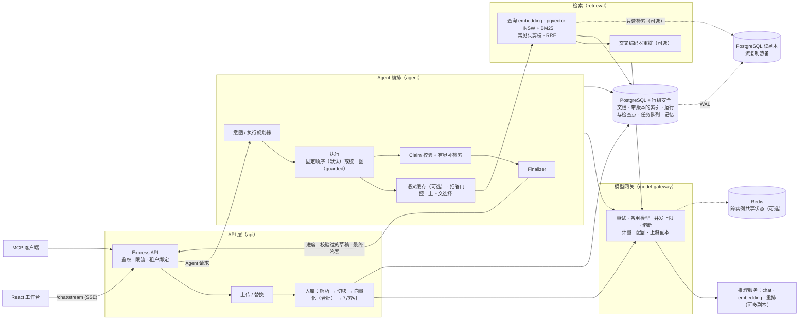

<div align="center">

# Luc1ferxx Archive RAG

**可信文档智能体：上传 PDF 后提问、对比、审查，每个结论都能追溯到页级证据；证据不够就补检索、澄清或拒答。**

<p>
  <a href="https://github.com/luc1ferxx/Luc1ferxx_Archive_RAG/actions/workflows/quality-gate.yml"></a>
  <a href="https://github.com/luc1ferxx/Luc1ferxx_Archive_RAG/actions/workflows/real-model-eval.yml"></a>
  
  
  
</p>

[架构](#架构) · [快速开始](#快速开始) · [实测结果](#实测结果) · [文档](#文档) · [当前限制](#当前限制)

</div>

## 它能做什么

- 在选中的文档或整个工作区里提问，回答附带页码、摘录和来源文件。
- 多文档结构化对比：每份文档独立检索，数值绑定到出处，能识别"没有实质差异"。
- 证据不足时补检索、请求澄清或明确拒答，不编一个看起来合理的答案。
- 后台 Agent 任务、审批门和运行记录都持久化，进程崩溃后可以恢复；高风险动作要人工审批。
- 多租户、多实例部署；上传可以异步入库，换 embedding 模型时零停机重建索引。
- 默认一个进程；需要时可以拆成 API、Agent 编排、检索、模型网关几层，各自加副本；检索可以分流到 PostgreSQL 读副本。
- 可以作为 MCP server 供其他 Agent 调用，也能不连数据库单机运行。

## 架构


```mermaid
flowchart LR
  UI["React 工作台"] -->|"/chat/stream (SSE)"| API
  MCP["MCP 客户端"] --> API

  subgraph Edge["API 层（api）"]
    API["Express API<br/>鉴权 · 限流 · 租户绑定"]
    Upload["上传 / 替换"] --> Pipe["入库：解析 → 切块 → 向量化（合批） → 写索引"]
  end

  subgraph Agent["Agent 编排（agent）"]
    Plan["意图 / 执行规划器"] --> Exec["执行<br/>固定顺序（默认）或统一图（guarded）"]
    Exec --> Gate["语义缓存（可选） · 拒答门控 · 上下文选择"]
    Exec --> Check["Claim 校验 + 有界补检索"]
    Check --> Final["Finalizer"]
  end

  subgraph Retrieval["检索（retrieval）"]
    Hybrid["查询 embedding · pgvector HNSW + BM25<br/>常见词剪枝 · RRF"] --> Rerank["交叉编码器重排（可选）"]
  end

  subgraph ModelGateway["模型网关（model-gateway）"]
    GW["重试 · 备用模型 · 并发上限 · 熔断<br/>计量 · 配额 · 上游副本"]
  end

  API --> Upload
  API -->|"Agent 请求"| Plan
  Final -->|"进度 · 校验过的草稿 · 最终答案"| API
  Gate --> Hybrid
  Agent --> GW
  Retrieval --> GW
  Pipe --> GW
  GW --> Backends["推理服务：chat · embedding · 重排<br/>（可多副本）"]
  GW -.-> Redis[("Redis<br/>跨实例共享状态（可选）")]
  Hybrid --> PG
  Hybrid -.->|"只读检索（可选）"| Replica[("PostgreSQL 读副本<br/>流复制热备")]
  PG -.->|"WAL"| Replica
  Pipe --> PG
  Agent --> PG[("PostgreSQL + 行级安全<br/>文档 · 带版本的索引 · 运行与检查点 · 任务队列 · 记忆")]
```

一次请求怎么走：API 鉴权并绑定租户 → 规划器在白名单内选意图和步骤 → 执行文档检索、Skill、Web 和 Capability → 逐条校验结论是否有证据支持，必要时补检索一轮 → finalizer 删掉没有证据的内容，流式接口只推送校验过的整句。

图里的四个框默认都在一个进程里（`ARCHIVE_RAG_ROLE` 不设，即 `all`），层之间是函数调用。设了角色和服务地址后，每个框是一个独立进程，可以单独加副本，层之间走带签名内部身份的 HTTP。入库仍在 API 层（或独立的入库 worker），不经过检索层。

### 分层要点

**Agent 运行时**
- **模型只提议，运行时做决定。** 规划器只能在白名单里选意图、步骤和 Skill；权限、文档范围、预算、审批、并发都由运行时决定。
- **两种执行路径。**
  - 默认是固定的外层顺序，其中自定义 Skill 阶段是带类型的执行图（DAG）。
  - 打开 `AGENT_UNIFIED_GRAPH_ROLLOUT=guarded` 后，文档、Web、内置 Skill、Capability 都在一张统一图里执行，可以写"证据不足 → 查 Web → 交给 Skill"这类条件编排。
  - 两条路径共用一个 run store 和一套校验器；图要么整体接受，要么整体拒绝，不会只执行一半。
- **审批与恢复。**
  - 运行、步骤和检查点存在 PostgreSQL，用版本号做 CAS，挡住过期的 worker。
  - 图可以停在审批节点，批准后从检查点续跑，Capability 只执行一次。
  - 有副作用、状态又不明的步骤进入人工恢复，不会被自动重放。
- **一切有上限。** 补检索最多一轮，重规划最多一次；每次运行都有调用次数、token、成本和时长上限，超限时降级，不报错。

**检索与回答**
- **混合检索。**
  - pgvector 稠密检索和 PostgreSQL 上的 BM25 两路并行，结果用 RRF 融合。
  - 带文档过滤的 HNSW 查询打开了迭代扫描，不会少返回结果。
  - 检索范围大时自动做常见词剪枝。
- **可选增强。** 交叉编码器重排（bge-reranker-v2-m3）、语义缓存（带否定、数字、实体等守卫）、查询适配器（只变换查询向量的轻量 embedding 微调）。
- **先校验，再输出。**
  - "答不答"由门控决定：有重排分数时看重排概率，否则看问题词的覆盖率。决定作答后，还会补入其余候选段落作为上下文。
  - 每条结论都要得到它引用的证据支持：默认用词法规则判断，可选权限受限的 LLM 评审。

**数据与入库**
- **分阶段入库。**
  - 解析、切块、向量化、写索引四段各自落库、各自重试。
  - 跨文档合批做向量化。
  - 反复失败的任务进死信队列；同租户上传相同内容会去重；`PUT /documents/:docId` 原子替换文档。
- **异步与多实例。**
  - 异步模式下上传立即返回 202，由任意实例的 worker 或独立 worker 进程领取任务：`FOR UPDATE SKIP LOCKED` 领取，带租约和所有权校验；新任务通过 `LISTEN/NOTIFY` 立即唤醒 worker。
  - 别的实例上传或删除的文档，在本实例立即可见。
- **索引版本。**
  - 换 embedding 模型或重建索引时，新版本在后台建，可断点续建，期间新写入同时写新旧两个版本。
  - 校验通过后原子切换，所有实例 2 秒内跟上；可以回滚。
  - 查询只在当前激活版本的向量空间里做一次 embedding。

**拆分部署（可选）**
- **一个镜像，五种角色。** `ARCHIVE_RAG_ROLE` 选 `all`（默认，单进程）、`api`、`agent`、`retrieval` 或 `model-gateway`。`AGENT_SERVICE_URL`、`RETRIEVAL_SERVICE_URL`、`MODEL_GATEWAY_URL` 各列一个或多个副本；每一层都忽略指向自己的地址，所以同一份配置可以发给所有进程。
- **API 层**只做公网入口：鉴权、限流、上传、文档、入库任务、管理接口。Agent 请求按单体的同一套规则校验后转发给 agent 层；它不跑 Agent，也不做启动恢复。
- **层间身份。**
  - 租户只写在短期签名 token（默认 60 秒）里，接收方按它设置访问范围和数据库租户；请求体里的租户字段一律不认，公网请求带来的内部请求头在入口就被删掉。
  - 默认所有层共用一组 HMAC 密钥（HS256）；`INTERNAL_SERVICE_AUTH=ed25519` 时每层只持有自己的 Ed25519 私钥，每把公钥只对登记的那一层有效，被攻破的一层不能冒充别的层。`mixed` 用于不停机切换。
  - 谁能调用谁由一张表决定，在接收方执行。每个 token 绑定方法、路径和请求体摘要，`ed25519` 下默认每个 token 只接受一次。`node server/service-keys.mjs` 生成密钥，只打印、不写文件。
- **调用与故障。** 选进行中请求最少的副本；连不上或返回 502/503/504 的副本暂时跳过；已经发出的 `/chat` 不会重发到另一个副本。入口的超时作为截止时间一路传下去，每一跳只用剩余的时间，到点时 agent 层取消运行。检索层或模型网关不可用时 `/chat` 返回 503/504、`Retry-After` 和固定错误码，不带地址、问题或文档内容。开启 OpenTelemetry 时，跨层是同一条 trace。
- **检索层**按调用方的租户在行级安全下检索，别的租户的文档和不存在的文档返回完全一样的结果。远程检索的结果与进程内逐字段相同（有测试比对），调用方不读分块表，也不做检索用的 embedding。
- **模型网关**集中执行重试、备用模型、并发上限、熔断，另外做用量计量、按 workspace 的配额，并在多个 chat、embedding、重排上游之间分配请求。调用方代码不变：设了 `MODEL_GATEWAY_URL`，模型调用就自动经过网关。

**基础设施**
- **多租户隔离。**
  - 每条带租户范围的 SQL 都在事务里切换到租户角色，由行级安全兜底：即使漏写了过滤条件，也读不到其他租户的数据。
  - 租户设置和语句用扩展协议流水线一次往返发出。
  - 行级安全下全文检索用不上 GIN（`@@` 不是 leakproof），多文档检索改由一个只返回 id 和分数的 owner 函数排序。
- **读副本（可选）。**
  - 设了 `POSTGRES_READ_REPLICA_URLS` 后，带租户的 pgvector 检索可以交给流复制热备；写入、迁移、文档列表、运行和任务的读取都留在主库。
  - 副本在同一次往返里先过新鲜度检查：每个被检索文档的版本不低于主库上的、索引指针不旧于这次检索用的，否则由主库回答。按 LSN 测延迟，超过上限的副本不用。
  - 副本出任何错误都回退主库，请求不会因此失败；每个副本有自己的熔断。
- **模型调用。** 退避重试、遵守 Retry-After、切换备用模型、每个模型有并发上限和熔断；配置 Redis 后多个实例共享这些状态。拆分部署时这些都在模型网关里执行。规划器输出用 strict JSON Schema 约束。
- **截止时间、取消和依赖故障。**
  - 可以给每个 Agent 请求设截止时间（`AGENT_REQUEST_TIMEOUT_MS`），或在客户端断开时取消（`AGENT_CANCEL_ON_DISCONNECT=on`），默认都关。
  - 取消后，进行中的模型和检索调用被中止，运行在下一个安全点停下，记为 `failed` 或 `canceled`；已经开始的写操作会跑完，不会被打断。
  - 模型、检索或数据库不可用时 `/chat` 返回 503/504 和 `Retry-After`，运行记为可重试的失败，不再当成"证据不足"去请求 Web 搜索审批。
- **提示注入防御。** 检索到的文本、文件名和网页结果进入 prompt 前先经过确定性筛查；答案里模型没见过的链接会被删除。
- **可观测、可评测。**
  - OpenTelemetry GenAI trace 记录每个规划器、Skill 和模型调用的耗时与 token；每个 prompt 都有版本和指纹。
  - `METRICS_ENABLED=true` 时每个进程在单独端口上提供 Prometheus `/metrics`：HTTP、Agent 运行、模型、检索、入库、PostgreSQL、读副本、层间调用和进程指标；标签里没有租户、文档或问题。`deploy/prometheus/` 有 `/chat` 的 SLO 记录规则、燃烧率告警和运维告警。
  - 效果结论来自外部标注数据（QASPER），附配对 bootstrap 置信区间。调参在 train 上做、在 dev 上确认，决策规则事先定好。

### 代码地图

| 位置 | 内容 |
| --- | --- |
| `server/app.js`、`server/routes/` | 组合根和按功能拆分的路由，入参用 zod 校验 |
| `server/rag/agent*.js` | 规划、执行计划、Skill DAG、文档循环、收尾、运行记录与恢复 |
| `server/rag/agent-unified-*.js` | 统一图：规划器与模型适配器、准入规则、执行、审批续跑、恢复 |
| `server/rag/document-rag-execution.js`、`confidence.js`、`reranker.js` | 问答检索、拒答门控、上下文选择、重排 |
| `server/rag/vector-store-pgvector*.js` | pgvector 存储、BM25 与剪枝、索引版本（建、校验、切换、回滚、退役） |
| `server/rag/semantic-cache*.js`、`query-adapter.js`、`embedding-cache.js` | 语义缓存与守卫、查询适配器、按向量空间分开的查询 embedding 缓存 |
| `server/rag/ingest-*.js` | 入库任务队列、分阶段流水线、跨文档合批、worker |
| `server/rag/postgres*.js` | 连接池、租户流水线、行级安全下的租户上下文、读副本路由与延迟监控、run store、`LISTEN` 连接 |
| `server/rag/self-check/` | Claim 校验（词法规则、数字归一化、LLM 评审） |
| `server/rag/openai*.js`、`model-call-guard.js`、`shared-state.js` | 模型调用：重试、备用模型、并发上限、熔断、共享状态 |
| `server/rag/service-topology.js`、`service-identity*.js`、`service-token-replay.js`、`service-client.js`、`server/service-keys.mjs` | 拆分部署：角色与服务地址、层间签名身份（HMAC / Ed25519、调用策略、请求绑定、防重放）、密钥工具、带副本选择和故障转移的客户端 |
| `server/rag/request-deadline.js`、`dependency-outage.js` | 请求截止时间与取消、依赖故障的分类和 503/504 应答 |
| `server/rag/metrics*.js`、`deploy/prometheus/` | Prometheus 指标、独立的 `/metrics` 监听、记录规则和告警规则 |
| `server/rag/agent-service/`、`server/server.js` | 按角色启动和停机、公网入口的转发、agent 层应用 |
| `server/rag/retrieval-service/`、`server/retrieval-service.mjs` | 检索层服务、远程检索客户端、无损编码 |
| `server/rag/model-gateway/`、`server/model-gateway.mjs` | 模型网关服务、上游副本池、配额、用量账本、调用侧客户端 |
| `server/db/migrations/` | 表结构、行级安全策略、BM25 统计、索引版本、入库任务 |
| `server/evaluation/` | 评测、压测、规模测试和质量门禁 |
| `src/` | React 工作台 |

## 快速开始

**一键部署**（API、前端和 PostgreSQL 一起启动，打开 http://localhost:5001）：

```bash
cp server/.env.example server/.env   # 至少填 OPENAI_API_KEY，或按下面的方式改用本地模型
docker compose --profile app up -d --build
```

可选组件：`--profile layout` 加 Docling 版面解析，`--profile shared-state` 加 Redis 共享状态；交叉编码器重排要同时带 `-f compose.rerank.yml --profile rerank`。详见 [docs/deployment.md](docs/deployment.md)。按层拆成独立进程见 [docs/deployment.md 的"拆分部署"](docs/deployment.md#拆分部署可选)。

**本地开发：**

```bash
npm install && (cd server && npm install)
cp .env.example .env && cp server/.env.example server/.env
docker compose up -d   # 只启动 PostgreSQL 16 + pgvector，端口 5432
npm run dev            # 前端 http://localhost:3000，后端 http://localhost:5001
```

`POSTGRES_DATABASE_URL` 默认已经指向上面的容器。检查启动状态：`curl http://localhost:5001/health`。

**不花钱，用本地模型：** 安装 [Ollama](https://ollama.com)，执行 `ollama pull qwen2.5:7b` 和 `ollama pull nomic-embed-text`，再在 `server/.env` 里设置：

```env
OPENAI_API_KEY=ollama
OPENAI_BASE_URL=http://127.0.0.1:11434/v1
OPENAI_CHAT_MODEL=qwen2.5:7b
OPENAI_EMBEDDING_MODEL=nomic-embed-text
RAG_EMBEDDING_DIMENSIONS=768
```

**常用开关**（完整列表见 [docs/configuration.md](docs/configuration.md)）：

| 开关 | 作用 |
| --- | --- |
| `DOCCOMPARE_STANDALONE=1` | 没有 PostgreSQL 时改用文件存储 |
| `ARCHIVE_RAG_ROLE=api\|agent\|retrieval\|model-gateway` | 拆分部署时这个进程跑哪一层；不设就是 `all`，单进程 |
| `AGENT_SERVICE_URL` / `RETRIEVAL_SERVICE_URL` / `MODEL_GATEWAY_URL` + `INTERNAL_SERVICE_KEYS` | 把对应的工作交给独立的层（可列多个副本），层间用这组密钥签名 |
| `INTERNAL_SERVICE_AUTH=ed25519` + `INTERNAL_SERVICE_SIGNING_KEY` / `INTERNAL_SERVICE_TRUSTED_KEYS` | 层间改用每层自己的 Ed25519 密钥（`node server/service-keys.mjs` 生成） |
| `POSTGRES_READ_REPLICA_URLS` | 带租户的检索交给 PostgreSQL 读副本，延迟超过 `POSTGRES_READ_REPLICA_MAX_LAG_MS` 的副本不用 |
| `AGENT_REQUEST_TIMEOUT_MS` / `AGENT_CANCEL_ON_DISCONNECT=on` | Agent 请求的截止时间 / 客户端断开时取消运行 |
| `METRICS_ENABLED=true`（`METRICS_PORT`、`METRICS_HOST`、`METRICS_TOKEN`） | 在单独端口上提供 Prometheus `/metrics` |
| `RAG_INGEST_MODE=async` | 上传立即返回 202，由 worker 入库（`npm run worker:ingest` 可单独起 worker） |
| `AGENT_UNIFIED_GRAPH_ROLLOUT=guarded` | 用统一图执行整个请求 |
| `RAG_RERANK_ENABLED=true RAG_RERANK_PROVIDER=cross-encoder` | 打开交叉编码器重排 |
| `RAG_SEMANTIC_CACHE=on` / `RAG_EMBEDDING_QUERY_ADAPTER=<文件>` | 语义缓存 / 查询适配器 |
| `RAG_SPARSE_SCORING=ts_rank_cd` | 全文检索改回 PostgreSQL 的 `ts_rank_cd`（默认 BM25） |
| `PDF_PARSER=docling` | 用 Docling 解析 PDF |
| `RAG_CLAIM_JUDGE=llm` | 打开 LLM 评审 |
| `OTEL_TRACING_ENABLED=true` | 导出 trace |

## 常用命令

| 命令 | 作用 |
| --- | --- |
| `npm run dev` | 同时启动前端和后端 |
| `npm test` / `cd server && npm test` | 前端测试 / 后端测试（需要 PostgreSQL 或 Redis 的集成测试在没有对应服务时报告为跳过） |
| `cd server && bash scripts/run-pgvector-integration.sh` | 在一次性 PostgreSQL 上跑数据库集成测试 |
| `cd server && bash scripts/run-pgvector-replica-integration.sh` | 在一次性主库 + 流复制备库上跑读副本集成测试 |
| `cd server && node service-keys.mjs generate <issuer>` / `compose` | 生成层间 Ed25519 密钥（只打印，不写文件） |
| `cd server && npm run coverage:gate` | 后端覆盖率门禁 |
| `cd server && npm run quality:current` | PR 质量门禁 |
| `cd server && npm run verify:quality` | 用真实模型跑端到端检查：问答、对比、拒答、跨进程持久化 |
| `cd server && npm run eval:qasper-retrieval` / `eval:qasper-answers` | QASPER：证据召回 / 官方答案 F1 与拒答 |
| `cd server && npm run eval:trajectory` / `eval:unified-graph-planner` | Agent 轨迹评测 / 统一图规划器（`-- --real` 用真实模型） |
| `cd server && npm run eval:llm-resilience` / `eval:prompt-injection` / `eval:tenant-isolation` | 故障注入 / 提示注入红队 / 行级安全 |
| `cd server && npm run eval:load-test:pgvector` / `eval:load-test:cluster` / `eval:load-test:ingest` | 压测：单实例 / 多实例 / 上传入库 |
| `cd server && npm run bench:pgvector-scale` | pgvector 从 1 万到 100 万分块的规模测试 |
| `cd server && npm run vector:index -- status\|build\|activate\|rollback` | 索引版本管理 |
| `cd server && npm run ingest:jobs -- dead-letter list\|requeue` | 入库死信队列 |

全部评测命令和门禁规则见 [docs/evaluation.md](docs/evaluation.md)。

## 实测结果

数字来自本地 7B 模型（`qwen2.5:7b` + `nomic-embed-text`）和单台机器，不是 GPT 级模型，也没有生产流量。差异附配对 bootstrap 95% 区间，区间不含 0 才称"显著"。命令和细节见 [docs/evaluation.md](docs/evaluation.md)。

**检索与问答**（QASPER dev，外部标注，不用 LLM 评审）

| 改动 | 结果 |
| --- | --- |
| embedding 任务前缀 | 证据进入候选 0.648 → 0.692，显著 |
| 门控只决定答不答，上下文补全候选 | 证据进入模型上下文 0.245 → 0.353，显著 |
| 交叉编码器重排 | 证据进入上下文 0.353 → 0.417，显著；可回答题被拒 42.2% → 37.8% |
| 重排概率做拒答门控 | 可回答题被拒 37.8% → 13.9%，不可回答题识别 80% → 45%（按事先定的代价规则采用） |
| 查询适配器 | 证据进入候选 0.692 → 0.738，显著；答案 F1 不变 |
| 答案变短（prompt v2.2） | F1 0.206 → 0.231，显著 |
| 测了、没改默认 | 降低词覆盖阈值（F1 显著变差）、两段式拒答（识别率变差）、Docling（表格题不显著，慢 250 倍）；BM25 与 `ts_rank_cd` 无显著差异（默认用 BM25 是产品选择）；Agent 答题率的 7 个开关（QASPER train 50 题：评审关时 0/41 → 0/41；只有开评审才多答，但不可答题被回答 0/9 → 4/9） |

**系统与规模**（假模型，单台机器）

| 方面 | 结果 |
| --- | --- |
| 端到端 `verify:quality` | 18/18，本机和 GitHub 上的真实模型 CI 一致 |
| 数据库往返 | 每次 `/chat` 在行级安全下 167 → 22；4 实例吞吐 205 → 283 req/s |
| 多实例 | 1/2/4 个实例 88/161/240 req/s；Redis 共享的模型并发上限对整个集群严格生效 |
| 全文检索 | 行级安全下 1000 篇文档 p50 142 → 19 ms；全表含常见词 p95 135 → 49 ms |
| 入库 | 独立 worker 35 篇/秒，同步 25 篇/秒；上传请求从约 257 ms 变成几毫秒的 202 |
| 索引版本 | 2 实例持续压测下换 embedding 维度并切换、回滚，0 错误；建版本 8.6 → 33 篇/秒（4 篇并行） |
| pgvector 规模 | 100 万分块 10.4 GB；单文档检索 p95 < 1 ms；跨 100 篇文档混合检索 p95 约 21 ms（热缓存） |
| 拆分部署 | 每多一跳 p50 +4.3 ms；瓶颈在 agent 层时 agent ×2 / ×4 吞吐 1.84 / 2.75 倍，其他层扩容 1.00 倍；同一台机器上相同进程数的单体仍快 1.56 倍 |

| 读副本 | 每次 `/chat` 主库语句 39.2 → 27.9（−28.8%，没达到事先定的 30%，副本连接池并发高时会满）；暂停回放下没有读到过时或已删除的内容；吞吐不变 |
| 截止时间 | 300 ms 截止、模型 800 ms：234 次运行全部按时以 504 结束，进行中的模型调用全部中止 |

**可靠性与安全**

| 方面 | 结果 |
| --- | --- |
| 模型调用容错 | 限流下成功率 79% → 100%；主模型宕机时 0% → 100%，熔断后 p50 2.6 s → 24 ms |
| 多实例共享状态 | 服务饱和时 SLO 内成功率 29.2% → 100% |
| 提示注入（13 个攻击 × 3 轮） | 攻击进入答案 17/39 → 0/39；刻意改写的攻击仍能绕过 |
| 行级安全 | 漏写过滤条件时泄露的表 9/9 → 0/9 |
| 语义缓存 | 留出的"近义但意思不同"问题误命中 0/59；每次命中省约 1.35 s |
| 审批续跑 | 跨进程测试 14/14：批准后 Capability 恰好执行一次，写入后崩溃进入人工恢复 |

## 文档

| 文档 | 内容 |
| --- | --- |
| [docs/agent-rag.md](docs/agent-rag.md) | Agent 闭环、Skill 与 DAG、校验、流式、预算、trace、调用链、优化路线 |
| [docs/unified-agent-dag-migration.md](docs/unified-agent-dag-migration.md) | 统一图：解冻条件、准入规则、审批续跑、真实模型规划结果 |
| [docs/retrieval-tuning.md](docs/retrieval-tuning.md) | BM25 与常见词剪枝、语义缓存、查询适配器 |
| [docs/data-lifecycle.md](docs/data-lifecycle.md) | 索引版本（零停机重建、切换、回滚）和分阶段入库流水线 |
| [docs/evaluation.md](docs/evaluation.md) | 评测命令、质量门禁、所有改前 / 改后数字 |
| [docs/configuration.md](docs/configuration.md) | 环境变量（含读副本、层间身份、截止时间、指标） |
| [docs/deployment.md](docs/deployment.md) | Docker 一键部署、各个 profile、异步入库和多实例、按层拆分部署、层间密钥的生成和轮换、读副本、指标与告警 |
| [docs/operations.md](docs/operations.md) | `/chat` 的 SLO、每条告警的含义和处理步骤 |
| [docs/development.md](docs/development.md) | API、目录结构、工程化基线、开发约束 |

## 当前限制

- **模型**：真实模型数字只来自本地 7B 模型，没有 GPT 级模型、生产流量或真实的单次查询成本数据。用 7B 规划统一图时，只有 3/15 的计划被接受，其余回落到确定性图。
- **评测**：没有人工标注的黄金集，外部标注只用了 QASPER；LLM 评审只在构造的对照集上校准过，默认关闭。
- **校验**：默认的词法校验对改写很严格。不开评审时，Agent 路径常常转为请用户澄清：QASPER train 50 题里一道可答题都没答出来，为此加的 7 个开关（屈折、章节标题、标签继承、follow-up 用原问题、单文档路由等）单开或全开都没改变这一点。开评审能多答，但同时会回答不可答题，也放行了明显错答；再加上答案模型的拒答标记（`RAG_QA_ANSWER_VERDICT`），train 上没有回答不可答题，但 dev 上仍答了 2/9 道（基线 0/9），也没有通过。第三轮给拒答标记加了确定性复核（`RAG_QA_VERDICT_OVERRIDE`），用来修 `verify:quality` 里的误拒，结果也没有通过：在 QASPER train 上，复核一次都没让答案通过；候选答了 1/7 道不可答题（基线 0/7），走的是普通作答路径。所以评审、拒答标记、复核和这些开关都保持关闭。
- **拒答**：门控的区分能力有限（词覆盖 AUC 约 0.59，重排概率约 0.64）；按代价规则选出的阈值偏向多答。
- **检索**：BM25 没证明优于 `ts_rank_cd`；只由常见词组成的查询剪枝后，前 10 条会和不剪枝时明显不同；查询适配器只针对 QASPER 训练，换语料要重训。
- **安全**：提示注入的确定性筛查挡不住刻意改写；行级安全防的是漏写过滤条件的 bug，不防 SQL 注入；只有静态 token，没有 SSO。
- **规模与运维**：所有测量都在一台机器上、用假模型；没有 K8s、自动扩缩和备份演练；重排服务只能跑 CPU。告警规则和 SLO 目标（99.5% 可用、95% 在 20 秒内）是建议值，规则没有用 promtool 检查过，也没在真实的 Prometheus 里跑过；compose 文件里没有打开指标，也没有 Prometheus 和 Alertmanager。
- **读副本**：只在同一台机器上的主库 + 一个流复制备库上测过；只分流 pgvector 检索，没有访问范围的请求（owner 路径）不分流；副本上的语句没有语句超时，也不受请求截止时间限制；`vector:reindex --apply` 期间落后的副本可能少返回重新向量化的分块，直到追上；不检查副本是否真的跟随这个主库。
- **截止时间**：模型并发上限的排队不响应取消；检索层不会因为调用方断开而停止；写操作越过截止时间跑完后，V1 路径把运行记为不可重试的失败，统一图则会完成运行，两条路径不一致；统一图里非主节点的依赖故障仍返回 409。
- **拆分部署**：只在一台机器上跑过，所有层共用一个 PostgreSQL；层间身份默认是共享密钥的 HMAC 签名，`ed25519` 也不是 mTLS，层间没有加密，内部端口只能放在内网；`ed25519` 只在四个独立进程的测试里跑通过（检索层用的是本地向量库），没在镜像里跑过；`compose.services.yml` 还没有真正构建和启动过；没有服务发现或 K8s 清单，副本列表写在环境变量里；没有 Redis 时，模型网关的配额、并发上限和熔断以及防重放缓存按进程计算；在同一台机器上，同样进程数的单体比拆分快（见上面的数字），拆分的价值是只给瓶颈层加副本。
