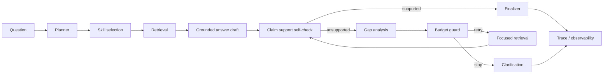

# AgentRAG Design

这份文档说明 RAG 和 AgentRAG 的执行路径。配置见 [configuration.md](configuration.md)，评测见 [evaluation.md](evaluation.md)。

## 回答闭环

核心目标是让回答过程可解释、可回归：

- Planner 先判断任务类型、文档数量、access scope 和是否需要 skill chain。
- Retrieval 保留文档边界，尤其是 compare 请求。
- Self-check 检查关键 claim 是否能被 citation excerpt 支持。
- Gap analysis 把 unsupported claim 转成 focused retrieval plan。
- Budget guard 阻止无限 follow-up。
- Finalizer 删除或降级仍未被 citation 支持的 claim。

## QA 路径

1. 结合会话记忆把追问改写成独立检索问题。
2. 对复杂问题拆分 evidence requirements，例如时间、生效范围、适用地区。
3. 生成 query embedding，并按选中文档检索。
4. 可选启用 dense + sparse hybrid retrieval，融合方式支持 weighted score 或 RRF。
5. 可选启用 rerank，位置在 retrieval/hybrid 之后、confidence gate 之前。
6. 使用置信度门控过滤低相关或缺少 anchor coverage 的证据。
7. 生成 grounded answer、citations、evidence summary 和 AgentRAG observability。

## Compare 路径

普通全局 top-k 很容易让最匹配的一份文档挤掉其他文档。Compare pipeline 从检索阶段保留文档边界：

1. 识别显式对比、比较级问题、跨文档一致性等信号。
2. 对每份文档分别检索 `RAG_COMPARE_TOP_K_PER_DOC` 条证据。
3. 对每份文档独立 rerank。
4. 对齐证据，分析 shared terms、近重复、数值差异和显式冲突。
5. 如果证据高度近似且无冲突，走 deterministic no-difference guard。
6. 否则生成结构化 comparison answer：Summary、Per document、Agreements、Differences、Gaps。

## Skill registry

AgentRAG 的工具能力通过 `server/rag/skills/registry.js` 注册。

内置 skills 位于 `server/rag/skills/built-ins.js`：

- `arxiv_import`
- `workspace_action`
- `document_rag`
- `web_search`
- `inventory`
- `document_discovery`
- `research_brief`

白名单 custom skills 位于 `server/rag/skills/custom/`：

- `extract_timeline`：从选中文档中提取带 citation 的时间线。
- `summarize_contract`：输出带 citation 的合同摘要。
- `risk_review`：生成带 citation 的风险、缺口、冲突和例外审查。
- `compare_documents`：生成结构化文档对比。

当前白名单 skill chain：

- `summarize_contract -> risk_review`
- `compare_documents -> risk_review`
- `extract_timeline -> compare_documents`

新增 skill 需要稳定的 `id`、`version`、`label`、`budgetKey`、`requiresAccessScope`、确定性的 `match()`，以及接收 `accessScope` 的 `execute()`。Custom skills 只通过 `server/rag/skills/custom/index.js` 白名单加载，不允许模型调用任意未注册工具。

## 关键模块

| 模块 | 职责 |
| --- | --- |
| `server/rag/agent-planner.js` | 请求分类、planner actions、skill/chain 选择、执行前 clarification 判断。 |
| `server/rag/arxiv-client.js` | arXiv Atom API 查询、feed 解析和 PDF 下载校验。 |
| `server/rag/arxiv-enrichment.js` | 从已上传文档的本地 profile keyphrases 生成 arXiv topic、过滤私密实体和内部术语、对候选做 relevance check、返回签名候选 token，保存 recommendation snapshot，并提供 arXiv recommendation import runner。 |
| `server/rag/arxiv-importer.js` | 按 topic 或已确认候选列表下载 arXiv PDF，导入前按 arXiv ID / PDF URL / title hash 去重，写入 `profile.source` provenance，通过现有文档 ingestion 写入索引，并通过可选 progress callback 汇报 per-paper 状态。 |
| `server/rag/arxiv-identity.js` | 规范化 arXiv ID、PDF URL 和 title hash，集中提供导入去重所需的身份匹配规则。 |
| `server/rag/external-query-policy.js` | 外部工具调用前的 query policy，统一清理 candidate query 中的私密实体、内部项目码和泛化敏感词；返回可记录的 sanitized query、redacted removed terms、risk flags 和 allow/deny 状态。 |
| `server/rag/recommendation-snapshots.js` | 保存 provider/doc/access-scope 维度的推荐 snapshot，供用户 dismiss 后从文档详情重新查看；当前 arXiv 使用该接口，未来外部 enrichment provider 可复用。 |
| `server/rag/tasks.js` | 定义 scope-aware task contract 和 async task service，接口只关心 task type/status/counts/subject/provider，不绑定具体 provider、数据库或执行方式。 |
| `server/rag/task-store.js` | 根据 `TASK_STORE_PROVIDER` 选择 task store adapter；默认 `auto` 会在 PostgreSQL 配好时使用持久化 store，否则使用内存 store。 |
| `server/rag/postgres-task-store.js` | PostgreSQL task store adapter，保存 task 当前快照和审计事件；内部 `payload` 只给 runner 使用，不从 API 暴露。 |
| `server/rag/agent-runs.js` | 定义 agent run contract 和 service，记录 goal、plan、steps、observations、decisions、approval gates、result/error 和审计 events。 |
| `server/rag/agent-run-step-executor.js` | 执行和恢复已持久化 run step；只负责 action/retry 编排和 step handler 派发，让 HTTP route 不绑定具体工具执行细节。 |
| `server/rag/agent-run-recovery.js` | 启动时扫描 recoverable run；PostgreSQL-backed agent run store 默认进入 auto recovery，只通过 step executor 恢复安全 RAG-only step；非持久化 run store 默认 manual，审批和未知 step 回落人工。 |
| `server/rag/agent-run-step-replay-safety.js` | 固定 step replay safety matrix：每类 step 的必需 input、retry/resume action、审批要求、auto replay 安全性和幂等性说明；recovery policy 和 handler registry 复用同一份 contract。 |
| `server/rag/agent-run-step-handlers.js` | 定义可插拔 step handler registry；当前 capability/web/arXiv 通过 capability adapter 执行，`document_rag` handler 预留可注入 resumer，未接线时返回稳定 409。 |
| `server/rag/agent-run-store.js` | 根据 `AGENT_RUN_STORE_PROVIDER` 选择 agent run store adapter；默认 `auto` 跟随 PostgreSQL 可用性，否则使用内存 store。 |
| `server/rag/postgres-agent-run-store.js` | PostgreSQL agent run store adapter，保存 run 当前快照和 run event log，供 `/agent-runs` 审计接口读取。 |
| `server/rag/job-orchestrator.js` | 根据 task 的 `runnerId` 分发 `confirm/cancel` 等动作，调度 runner 执行，启动时恢复 queued/running task，并把 queued/running/completed/failed/canceled 生命周期写回 task log。 |
| `server/rag/recommendation-tasks.js` | 将外部推荐发现、等待确认、排队导入、per-paper progress、导入完成或失败映射成 `external_recommendation` task；当前 arXiv 使用该 adapter，未来异步 ingestion job 可复用同一 task contract。 |
| `server/rag/agent-workflows/` | 定义 declarative workflow spec、registry 和内置 `research_dossier` contract；这里只描述触发条件、phase、capability/skill 期望、产物和完成检查，不执行 runner。 |
| `server/rag/agent-research-task.js` | 从 workflow registry 选择并渲染 task-level research flow；只推进 phase 和下一步问题，不直接调用 RAG、web、arXiv、custom skill 或 report export。 |
| `server/rag/agent-goal-plan.js` | 从 agent task payload / iteration / pending action 生成公开 goal plan；只写入 task `items` 和 `result.goalPlan`，不读取私有 evidence 或重新执行 planner。 |
| `server/rag/agent-goal-completion.js` | 生成 task-level 目标完成自检；只消费 plan item 状态、deliverable compact status、research phase status、required user action 和 working memory 计数。 |
| `server/rag/agent-goal-deliverables.js` | 从已完成 agent task 的 goal/answer/docIds 推导目标产物，统一构造 capability input、approval gates 和 compact result；runner 只调用 prepare/execute，不直接写 report、summary 或 follow-up task。 |
| `server/rag/execution-boundary.js` | 定义 capability / connector 执行前的 sandbox 和 secret policy 合同；只做规范化、校验、refs-only secret context 和 schema 外输入过滤，不执行真实 sandbox。 |
| `server/rag/connectors/` | 定义 connector/MCP adapter contract、白名单 registry 和 connector-backed capability adapter；connector capability 必须映射成现有 capability contract，默认不配置 executor 时拒绝执行。 |
| `server/rag/capabilities/` | 定义 capability registry 和 built-in adapters；capability contract 包含 `id/version/inputSchema/accessScope/approvalPolicy/privacyPolicy/execute()`，当前覆盖 arXiv topic import、web search、workspace document discovery、report export、recommendation import、document compare 和 action capabilities。 |
| `server/rag/arxiv-selection-token.js` | 对文档级 arXiv 推荐结果签名和验签，确保确认导入的是用户看到的候选。 |
| `server/rag/agent-query-planner.js` | 为 document/custom skill 生成 retrieval plan、动态 topK 和实际检索 queries。 |
| `server/rag/agent-document-loop.js` | Document RAG、self-check、gap analysis、follow-up retrieval、claim/gap 更新。 |
| `server/rag/agent-run-context.js` | Trace append、budget snapshot、agent trace 记录、clarification 响应 orchestration。 |
| `server/rag/agent-working-memory.js` | Run-scoped checked queries、supported/unsupported claims、resolved/unresolved gaps。 |
| `server/rag/agent-skill-observability.js` | Per-skill attempts、duration、citations、abstain、retry/follow-up、budget、error。 |
| `server/rag/agent-finalization-flow.js` | Agent mode resolution、source selection、synthesis、finalizer、最终响应组装。 |
| `server/rag/agent-response-builder.js` | `/chat` response fields、status code 行为、error wording。 |
| `server/rag/agent-trace.js` | Trace step summary 和 compact trace serialization。 |

`server/rag/agent.js` 应保留为主流程编排，不应重新堆入 planner、trace、working memory、observability 或 finalization 细节。

前端 Chat scope 控制只改变传给 `/chat` 的 `docIds`：默认 `Uploaded` 排除外部 arXiv 文档，`All` 包含工作区全部文档，`Selected` 使用用户在文档列表中勾选的文档。

## Action capabilities

真实 action 必须通过 `server/rag/capabilities/` 注册，不能绕过 capability registry 直接在 planner 或 runner 里写入状态。当前内置 action capabilities：

- `task.create`：创建 scoped action task。
- `document.organize`：根据 workspace document profile/tags 生成并保存文档整理结果。
- `summary.create`：保存已生成的摘要及其 doc/citation metadata。
- `external.import`：通过外部导入服务执行，或创建 scoped external import task。

这些 action 都使用 `user_confirmation` approval policy，并把可恢复执行所需的 sanitized input 固化到 approval gate `inputPreview`。用户批准后，恢复层创建 `capability_call` step；重试/恢复安全性继续由 `server/rag/agent-run-step-replay-safety.js` 的 `capability_call` policy 决定。Action 结果可以写入 task log，但不能作为 citation、claim support 或 final answer evidence；答案证据仍只能来自 document/web/capability 实际返回的证据字段。

Agent task 的最终产物也复用同一套 capability registry。`server/rag/agent-goal-deliverables.js` 只根据公开目标、最终回答和 docIds 生成产物规格，例如 markdown report、document organization、saved summary 和 follow-up task；`agent-tasks.js` 在回答完成后把 task 暂停为 `requiredUserAction: "approve_deliverables"`，用户批准后才执行这些 capability。这样目标交付不会绕过 action capability 的审批边界，也不会把产物结果误当成 RAG citation。

## Connector contracts

Connector / MCP adapter 层目前是 contract-only，不会自动加载真实外部工具。`server/rag/connectors/` 和 `server/rag/execution-boundary.js` 提供：

- `schema.js`：规范化和校验 connector spec。每个 connector capability 必须声明 `inputSchema`、`accessScope`、`approvalPolicy`、`privacyPolicy`、`sandboxPolicy`、`secretPolicy` 和 `replaySafety`，并且必须要求 user approval。
- `registry.js`：白名单注册 connector spec，按 connector id 和 capability id 去重，并把 connector capability 映射成现有 capability contract。
- `built-ins/test-connector.js`：测试用 connector spec，只用于合同测试，不进入默认 capability registry。
- `execution-boundary.js`：规范化和校验 `sandboxPolicy` / `secretPolicy`。外部调用必须声明允许 network 的 sandbox profile；workspace write 必须声明允许 workspace write；secret 只能以 uppercase ref name 暴露给 executor，不能传 secret value。

Connector capability 执行仍走 `server/rag/capabilities/registry.js` 的 `executeCapability()`，因此会先经过 approval gate、input schema、access scope 和 privacy sanitization。Batch 4/5 不新增 runner 行为，也不让模型直接调用任意 MCP/tool；未注入 executor 的 connector capability 即使获得批准也会返回稳定错误，避免 contract-only 阶段产生隐式外部调用。执行前还会过滤 schema 外输入，避免用户传入的 secret-like 字段被带进 connector executor。

## Research task / dossier

Durable agent task 支持一个 task-level `research_task` / dossier 流程。触发词包括 `research_task`、`dossier`、`research report`、`risk report`、`研究任务`、`研究型任务`、`调研报告`、`风险报告` 等。流程 spec 集中在 `server/rag/agent-workflows/built-ins/research-dossier.js`；`server/rag/agent-research-task.js` 只从 registry 选择 spec、渲染下一步 question 并推进公开 phase 状态。当前 phase 顺序是：

1. Local document research：生成本地文档 `research_brief`。
2. Web supplement：通过现有 `web.search` approval gate 补充当前外部上下文。
3. arXiv supplement：通过现有 `arxiv.import_topic` approval gate 导入相关论文。
4. Compare and risk review：多文档时走 `compare_documents -> risk_review`，单文档时走 `risk_review`。
5. Citation self-check：复用 document RAG self-check/gap analysis，列出 supported claims、unsupported claims 和 unresolved gaps。
6. Final dossier：生成最终 dossier answer，然后进入 goal deliverables。

这个流程不新增第二套 planner 或 skill runner。`agent-tasks.js` 只从 research flow 读取下一步 question；每一步仍走 `/chat` 的 intent/execution planner、skill registry、approval gate、agent run step persistence 和 recovery。每轮结果会记录到 task iteration，并在 `task.result.goalPlan.researchTask` 公开 phase status。最终 report export 会聚合 research flow 各阶段回答和 citations，但这些 task iteration 只用于产物汇总，不作为新的 RAG source 或 claim support。

## Goal plan

Durable agent task 对外暴露一个轻量 goal plan，让前端 Agent Run Center 可以展示目标、已完成 step、等待用户动作和最终交付状态：

- 公开计划步骤写在 task `items`，沿用通用 task item contract：`id`、`status`、`label`、`summary`、`result`、`error`。
- 汇总元数据写在 `task.result.goalPlan`：`goal`、`status`、`stoppedReason`、`currentStepId`、`counts`、`completedIterations`、`deliverables`、`goalCompletion`、`researchTask`、`maxIterations`、`requiredUserAction`。
- 生成逻辑集中在 `server/rag/agent-goal-plan.js`；`agent-tasks.js` 只在 create / run / resume 边界调用它。
- Goal plan 是展示和恢复控制合同，不作为 citation、claim support 或答案证据。

`task.result.goalPlan.deliverables` 是目标产物的公开 contract：等待批准时列出 planned deliverables，执行后列出 compact outputs，例如 report fileName 或 action task id。完整 capability input 和内部 task payload 不从 API 暴露。

`task.result.goalPlan.researchTask` 是 research/dossier 流程的公开 contract：暴露 phase id、label、status、summary、expected skill/capability、counts，以及不含 prompt 的 `workflow` lifecycle snapshot。这个 snapshot 包含 workflow id/version/type/label、当前 phase、completion check id、预期 deliverables 和 phase counts；不暴露完整 prompt、trigger patterns 或内部 task payload。

`task.result.goalCompletion` / `task.result.goalPlan.goalCompletion` 是目标完成自检 contract。它统一检查：task 是否 terminal completed、公开 plan steps 是否全部 completed、working memory 是否还有 unresolved gaps / unsupported claims、已请求 deliverables 是否全部 created、是否仍有 pending approval / user action、research task phases 是否完成，以及 workflow lifecycle contract 是否已记录。这个自检不重新执行 RAG，不把 evidence 写入 task memory；iteration 里只保存 working-memory 计数，供批准产物后仍可验证目标状态。

前端 `src/components/AgentRunCenter.js` 只消费 `/tasks` 返回的公开 task contract。它可以触发 `continue`、`approve` 或 `approve_deliverables` task action，但不会根据 summary 文本推断 replay safety、approval policy 或执行状态。

## `/chat` observability

`/chat` 响应会返回：

- `agentSkills`：本轮候选和实际选中的 skills。
- `agentTrace`：plan、query planner、skill chain、document RAG、self-check、gap analysis、follow-up、finalizer 等步骤。
- `agentObservability`：execution planner selected/fallback 状态、per-skill attempts、duration、citations、abstain、retry/follow-up、budget、error 和 working memory。
- `agentWorkingMemory`：本次 run 内的检索 query、supported/unsupported claims、resolved/unresolved gaps。

前端 trace UI 位于 `src/components/RenderQA.js`，会展示选中的 skills、skill chains、retrieval queries、evidence gaps、unsupported claims 和 finalizer 删除内容。

## Clarification gate

普通 scope 问题不应该抛异常。Agent 需要用户输入时，返回：

- `agentMode: "clarification"`
- `clarification.reason`
- `clarification.question`
- `agentTrace` 中的 `clarification_gate`

常见触发原因：

- `missing_required_documents`
- `comparison_requires_multiple_documents`
- `too_many_documents`
- `document_follow_up_budget_exhausted`

## Working memory

Working memory 是一次 agent run 内的短期状态，不写入长期记忆。它记录：

- 本次目标
- 实际执行过的 retrieval queries
- Supported / unsupported claims
- Resolved / unresolved gaps
- Execution loop counters

Feedback record 和 feedback corpus metadata 会保留这些信息，方便把负反馈定位到具体 skill 和执行阶段。

## Task memory

Durable agent task loop 使用 `server/rag/agent-task-memory.js` 维护 task-scoped memory。它保存在 task 内部 `payload.taskMemory`，不会出现在公开 task payload 中。内容只包括：

- 原始 goal。
- 已完成步骤的问题、agent mode 和短答案摘要。
- 失败原因摘要。
- 用户偏好。
- 下一步候选。

Task memory 只会作为 intent/execution planner 的 planning context 传入，并带有 `evidencePolicy: "planning_context_only"`。它不能作为 citation、RAG source、claim support 或 final answer evidence；答案证据仍只能来自 document/web/capability 的实际执行结果。
