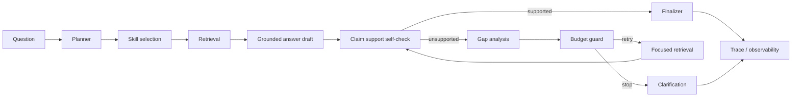

# AgentRAG Design

这份文档说明 RAG 和 AgentRAG 的执行路径。配置见 [configuration.md](configuration.md)，评测见 [evaluation.md](evaluation.md)。

## 回答闭环

核心目标是让回答过程可解释、可回归：

- Planner 先判断任务类型、文档数量、access scope 和是否需要 skill chain。
- Retrieval 保留文档边界，尤其是 compare 请求。
- Self-check 检查关键 claim 是否能被 citation excerpt 支持。
- Gap analysis 把 unsupported claim 转成 focused retrieval plan。
- Budget guard 阻止无限 follow-up。
- Finalizer 删除或降级仍未被 citation 支持的 claim。

## QA 路径

1. 结合会话记忆把追问改写成独立检索问题。
2. 对复杂问题拆分 evidence requirements，例如时间、生效范围、适用地区。
3. 生成 query embedding，并按选中文档检索。
4. 可选启用 dense + sparse hybrid retrieval，融合方式支持 weighted score 或 RRF。
5. 可选启用 rerank，位置在 retrieval/hybrid 之后、confidence gate 之前。
6. 使用置信度门控过滤低相关或缺少 anchor coverage 的证据。
7. 生成 grounded answer、citations、evidence summary 和 AgentRAG observability。

## Compare 路径

普通全局 top-k 很容易让最匹配的一份文档挤掉其他文档。Compare pipeline 从检索阶段保留文档边界：

1. 识别显式对比、比较级问题、跨文档一致性等信号。
2. 对每份文档分别检索 `RAG_COMPARE_TOP_K_PER_DOC` 条证据。
3. 对每份文档独立 rerank。
4. 对齐证据，分析 shared terms、近重复、数值差异和显式冲突。
5. 如果证据高度近似且无冲突，走 deterministic no-difference guard。
6. 否则生成结构化 comparison answer：Summary、Per document、Agreements、Differences、Gaps。

## Skill registry

AgentRAG 的工具能力通过 `server/rag/skills/registry.js` 注册。

内置 skills 位于 `server/rag/skills/built-ins.js`：

- `document_rag`
- `web_search`
- `inventory`
- `document_discovery`
- `research_brief`

白名单 custom skills 位于 `server/rag/skills/custom/`：

- `extract_timeline`：从选中文档中提取带 citation 的时间线。
- `summarize_contract`：输出带 citation 的合同摘要。
- `risk_review`：生成带 citation 的风险、缺口、冲突和例外审查。
- `compare_documents`：生成结构化文档对比。

当前白名单 skill chain：

- `summarize_contract -> risk_review`
- `compare_documents -> risk_review`
- `extract_timeline -> compare_documents`

新增 skill 需要稳定的 `id`、`version`、`label`、`budgetKey`、`requiresAccessScope`、确定性的 `match()`，以及接收 `accessScope` 的 `execute()`。Custom skills 只通过 `server/rag/skills/custom/index.js` 白名单加载，不允许模型调用任意未注册工具。

## 关键模块

| 模块 | 职责 |
| --- | --- |
| `server/rag/agent-planner.js` | 请求分类、planner actions、skill/chain 选择、执行前 clarification 判断。 |
| `server/rag/agent-query-planner.js` | 为 document/custom skill 生成 retrieval plan、动态 topK 和实际检索 queries。 |
| `server/rag/agent-document-loop.js` | Document RAG、self-check、gap analysis、follow-up retrieval、claim/gap 更新。 |
| `server/rag/agent-run-context.js` | Trace append、budget snapshot、agent trace 记录、clarification 响应 orchestration。 |
| `server/rag/agent-working-memory.js` | Run-scoped checked queries、supported/unsupported claims、resolved/unresolved gaps。 |
| `server/rag/agent-skill-observability.js` | Per-skill attempts、duration、citations、abstain、retry/follow-up、budget、error。 |
| `server/rag/agent-finalization-flow.js` | Agent mode resolution、source selection、synthesis、finalizer、最终响应组装。 |
| `server/rag/agent-response-builder.js` | `/chat` response fields、status code 行为、error wording。 |
| `server/rag/agent-trace.js` | Trace step summary 和 compact trace serialization。 |

`server/rag/agent.js` 应保留为主流程编排，不应重新堆入 planner、trace、working memory、observability 或 finalization 细节。

## `/chat` observability

`/chat` 响应会返回：

- `agentSkills`：本轮候选和实际选中的 skills。
- `agentTrace`：plan、query planner、skill chain、document RAG、self-check、gap analysis、follow-up、finalizer 等步骤。
- `agentObservability`：per-skill attempts、duration、citations、abstain、retry/follow-up、budget、error 和 working memory。
- `agentWorkingMemory`：本次 run 内的检索 query、supported/unsupported claims、resolved/unresolved gaps。

前端 trace UI 位于 `src/components/RenderQA.js`，会展示选中的 skills、skill chains、retrieval queries、evidence gaps、unsupported claims 和 finalizer 删除内容。

## Clarification gate

普通 scope 问题不应该抛异常。Agent 需要用户输入时，返回：

- `agentMode: "clarification"`
- `clarification.reason`
- `clarification.question`
- `agentTrace` 中的 `clarification_gate`

常见触发原因：

- `missing_required_documents`
- `comparison_requires_multiple_documents`
- `too_many_documents`
- `document_follow_up_budget_exhausted`

## Working memory

Working memory 是一次 agent run 内的短期状态，不写入长期记忆。它记录：

- 本次目标
- 实际执行过的 retrieval queries
- Supported / unsupported claims
- Resolved / unresolved gaps
- Execution loop counters

Feedback record 和 feedback corpus metadata 会保留这些信息，方便把负反馈定位到具体 skill 和执行阶段。

