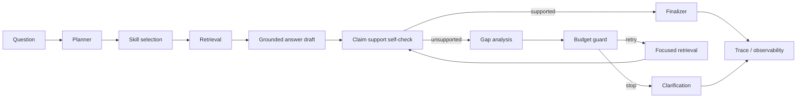

# AgentRAG Design

这份文档说明 RAG 和 AgentRAG 的执行路径。配置见 [configuration.md](configuration.md)，评测见 [evaluation.md](evaluation.md)。

## 回答闭环

```mermaid
flowchart LR
  Q["Question"] --> P["Planner"]
  P --> S["Skill selection"]
  S --> R["Retrieval"]
  R --> A["Grounded answer draft"]
  A --> C["Claim support self-check"]
  C -->|supported| F["Finalizer"]
  C -->|unsupported| G["Gap analysis"]
  G --> B["Budget guard"]
  B -->|retry| FR["Focused retrieval"]
  FR --> C
  B -->|stop| CL["Clarification"]
  F --> O["Trace / observability"]
  CL --> O
```

核心目标是让回答过程可解释、可回归。外层 execution plan 仍编排 document/Web/built-in/capability 等阶段；下面的 typed DAG 目前只在 custom Skill 阶段内部生效，不是全工具统一 DAG：

将所有阶段迁入同一受治理 DAG 的目标、不变量和验收门禁见 [统一 AgentRAG DAG 迁移决策](unified-agent-dag-migration.md)；v3 合同和 `shadow` 观测虽已部分接线，生产执行仍未完成。

- Planner 先判断任务类型、文档数量、access scope 和是否需要 skill chain。
- Retrieval 保留文档边界，尤其是 compare 请求。
- Self-check 检查关键 claim 是否能被 citation excerpt 支持。
- Gap analysis 把 unsupported claim 转成 focused retrieval plan。
- Budget guard 阻止无限 follow-up。
- Finalizer 删除或降级仍未被 citation 支持的 claim。

### 关键规则

- Planner 只在已注册 intent、skill、capability 和 step schema 里选择。
- 在 custom skill 的 V2 DAG 模式下，模型看到的是 runtime 从已注册、显式 typed contract、已核验 `accessScope` / `docIds` 构造的原子 Skill catalog，不受 V1 复合 intent/chain 限死。例如上游只选了 `compare_documents` intent，DAG planner 仍可在授权候选中规划 `compare_documents -> risk_review`；没有选中文档或文档无法按 scope 核验时不会扩大候选范围。V1 顺序链只在整张图被拒、尚无节点执行时兜底，或由运维显式设为 `off`。
- Planner 不决定权限、`docIds`、审批、secret、预算、并发和重试上限；这些由 runtime 拥有。custom skill 的 typed DAG 也一样：模型只产出节点和依赖，validator 整体接受或整体拒绝，非法图不会部分执行；runner 在执行前、把真实或恢复的输出交给下游前再次校验 typed contract。当前 typed 输出仍是 `text` / `citations` / `abstained` 的答案封套，不是已做语义验证的差异或风险对象。
- 文档读取、skill 执行、task 和 agent run 都携带 `accessScope`。
- Working memory 是 run-scoped，只记录本轮 queries、claims、gaps 和 loop counters。
- Agent experience memory 是规划提示，不是事实来源；答案证据仍必须来自 citations。
- Workspace artifact 是生成结果而非 RAG 来源；不会进入文档 registry、向量索引、citation、claim support 或 evidence。
- 对外部工具调用先经过 query policy 和 approval policy，避免把敏感实体直接带出工作区。
- Claim 校验的 LLM 评审只能把"无支持"改成"有支持"；引用错误、证据里没有的数字、对比答案不送评审，评审失败时保留词法结论。

## QA 路径

1. 结合会话记忆把追问改写成独立检索问题。
2. 对复杂问题拆分 evidence requirements，例如时间、生效范围、适用地区。
3. 生成 query embedding，并按选中文档检索。
4. 默认跑两路独立召回：dense 路（pgvector cosine；local / qdrant 为显式 opt-in）与 sparse 路（PostgreSQL FTS，`ts_rank_cd` 排序，不是 BM25），用 RRF 融合（weighted 可选，`RAG_HYBRID_ENABLED=false` 只跑 dense）。每个候选记录 route、原始 rank/score、fusion 分数和命中它的 retrieval query；多 query × 多路的结果按 `docId:chunkIndex` 稳定去重。`/chat` 响应附加 `retrieval` 块记录 provider 和两路是否真实产生候选。
5. 可选启用 rerank，位置在 fusion 之后、confidence gate 之前；rerank 不能替代任何一路召回。
6. 使用置信度门控过滤低相关或缺少 anchor coverage 的证据。
7. 生成 grounded answer、citations、evidence summary 和 AgentRAG observability。

## Compare 路径

普通全局 top-k 很容易让最匹配的一份文档挤掉其他文档。Compare pipeline 从检索阶段保留文档边界：

1. 识别显式对比、比较级问题、跨文档一致性等信号。
2. 对每份文档分别检索 `RAG_COMPARE_TOP_K_PER_DOC` 条证据。
3. 对每份文档独立 rerank。
4. 对齐证据，分析 shared terms、近重复、数值差异和显式冲突。
5. 如果证据高度近似且无冲突，走 deterministic no-difference guard。
6. 否则生成结构化 comparison answer：Summary、Per document、Agreements、Differences、Gaps。

## Skill registry

AgentRAG 的工具能力通过 `server/rag/skills/registry.js` 注册。

内置 skills 位于 `server/rag/skills/built-ins.js`：

- `arxiv_import`
- `workspace_action`
- `document_rag`
- `document_evidence_check`（仅供 v3 图使用，不参与 V1 intent 匹配）
- `web_search`
- `inventory`
- `document_discovery`
- `research_brief`

白名单 custom skills 位于 `server/rag/skills/custom/`：

- `extract_timeline`：从选中文档中提取带 citation 的时间线。
- `summarize_contract`：输出带 citation 的合同摘要。
- `risk_review`：生成带 citation 的风险、缺口、冲突和例外审查。
- `compare_documents`：生成结构化文档对比。

当前白名单 skill chain：

- `summarize_contract -> risk_review`
- `compare_documents -> risk_review`
- `extract_timeline -> compare_documents`

新增 skill 需要稳定的 `id`、`version`、`label`、`budgetKey`、`requiresAccessScope`、确定性的 `match()`，以及接收 `accessScope` 的 `execute()`。Custom skills 只通过 `server/rag/skills/custom/index.js` 白名单加载，不允许模型调用任意未注册工具。

V1 使用 intent / `match()` 选择上述固定 chain。V2 的模型候选则由 `server/rag/skills/authorized-catalog.js` 从同一个已注册 custom Skill 集合独立构造：每个候选须显式声明 `inputSchema`、`outputSchema`、`effects` 和 scoped `docIds` 输入；runtime 先用 `ragService.getDocument(docId, accessScope)` 核验请求中的每份文档。缺少文档、scope 或无法核验时返回空 catalog，不会借普通 QA 请求授权整套 Skill。V1 推导出的安全默认 contract 不会自动变成模型可调用的 V2 候选。因此上游 Intent 即使只选了 `compare_documents`，guarded DAG planner 也能在获授权的原子候选中提出 `compare_documents -> risk_review`；V1 原有选择和确定性回退仍只使用 V1 已选 Skill。

## Custom skill 执行：V1 chain 与 V2 typed DAG

Custom skill 阶段内部有两条执行路径，由 `AGENT_SKILL_GRAPH_ROLLOUT` 选择。两条路径共用同一个 stage、同一种 `custom_skill` step、同一个 run store 和同一份 replay safety matrix；execution plan 仍然只有一个 `custom_skills` 阶段，`/chat` 响应结构不变。切换入口集中在 `server/rag/agent-custom-skill-stage.js`，由 `server/rag/agent-execution-plan-runner.js` 调用。

### V1：顺序 skill chain

`server/rag/agent-custom-skill-runner.js` 按 planner 选定的白名单 chain 顺序执行，step id 是 `custom_skill:<skillId>`。它的数据接口是拼接文本：`buildChainedSkillQuestion()` 把前面 skill 的回答拼进下一个 skill 的 question。这条路径保持原样，没有被删除也没有被改写。

### V2：typed DAG

| 环节 | 模块 | 职责 |
| --- | --- | --- |
| Skill contract | `server/rag/skills/skill-contract.js` | 在既有 `id/version/budgetKey/requiresAccessScope/match/execute` 之外补充 `inputSchema`、`outputSchema`、`effects`、`idempotency`、`parallelSafe`、`replaySafe`；旧 skill 可由 `inferSkillContractDefaults()` 推出 V1 兼容默认值，但只有显式 typed contract 才可进入 V2 授权 catalog。 |
| 授权 catalog | `server/rag/skills/authorized-catalog.js` | 独立于复合 intent，按注册表、显式 contract、`accessScope` 和选中文档核验，给 DAG planner 提供原子 custom Skill 候选。 |
| Graph contract | `server/rag/agent-execution-graph.js` | 版本化 `ExecutionGraph`；node 至少包含 `nodeId`、`skillId`、`dependsOn`、`inputBindings`、`failurePolicy`、`rationale`。同一个 skill 可以出现在多个 `nodeId` 下，step id 变成 `custom_skill:<nodeId>`。 |
| Validator / compiler | 同上的 `validateExecutionGraph()` / `compileExecutionGraph()` | 纯函数校验和拓扑分层，返回稳定 reason code。 |
| Planner adapter | `server/rag/agent-dag-planner-adapter.js` | 直接产出原子 skill node 和依赖，不再输出 `skill_chain_compare_risk` 这类复合 id。 |
| Scheduler | `server/rag/agent-execution-graph-runner.js` | 拓扑调度、并发上限、预算预留、side-effect 串行化，以及解析后的输入和真实/恢复输出的运行时 schema gate。 |
| Replanner | `server/rag/agent-replanner.js` | 有界局部重规划，只返回 graph patch。 |

Node 输入只有两个来源：已校验的 request 字段，或它显式 `dependsOn` 的上游 node 的 typed 输出字段（`inputBindings` 的 `source` 只接受 `request` 和 `node`）。这是和 V1 最实质的区别——拼接自由文本不再是主数据接口。当前输出 schema 是 `text`、`citations`、`abstained` 的答案封套，`priorFindings` 仍是上游 `text` 字段；它没有把对比差异或风险变成经过语义验证的独立对象。

### Validator

`validateExecutionGraph()` 是纯函数，在任何 node 执行之前整体接受或整体拒绝一张图；`compileExecutionGraph()` 只在校验通过后产出拓扑层。非法图不会部分执行。初始 plan 和每一次 replan 走同一个 validator。当前 reason code：

`empty_graph`、`invalid_graph_version`、`invalid_node_shape`、`duplicate_node_id`、`dangling_dependency`、`self_dependency`、`cycle_detected`、`illegal_output_reference`、`input_type_mismatch`、`missing_required_input`、`out_of_scope_document`、`unregistered_capability`、`forged_approval`、`forged_policy`、`unsafe_parallel_side_effect`、`max_nodes_exceeded`、`max_depth_exceeded`、`budget_exceeded`。

`forged_approval` / `forged_policy` 覆盖 runtime 独占字段：planner 写入 `approval`、`approvalGateId`、`approvedGate`、`accessScope`、`budget`、`budgetKey`、`concurrency`、`docIds`、`maxReplans`、`requiresApproval` 等字段时整图被拒，而不是被静默清洗——静默清洗会让 planner 学到"多要一点没有代价"。

默认上限在 `EXECUTION_GRAPH_LIMITS`：`maxNodes: 12`、`maxDepth: 5`、`maxConcurrency: 3`。

静态图验证后仍有运行时边界：runner 在预算预留和 Skill 执行前检查解析后的输入值，在结果可供下游 `inputBindings` 使用前检查 Skill 的真实输出；恢复复用的 node 输出也要按当前 live contract 复核。schema 不符的结果不会被当作成功的上游事实。这里验证的是形状/类型，不替代 citation 和 claim support 的语义检查。

### Scheduler

调度顺序按 node 声明顺序做稳定拓扑排序，因此同一张图的调度是可复现的。只有依赖已满足、`parallelSafe`、彼此无冲突的只读 node 才会并发；并发上限由 runtime 收敛，调用方传入的 `maxConcurrency` 只能收紧不能放宽。预算在启动前原子预留，approval interrupt 会把预留退回，避免一次审批被计费两次。`failurePolicy` 为 `fail_fast` 的 node 失败后中止后续调度，`continue` 则只让下游 node 标记为 `dependency_failed` / `dependency_skipped`。

### 有界 replan

触发条件限定为 `insufficient_evidence`、`retryable_failure`、`output_schema_failure`、`missing_input`、`unmet_success_criterion`。Replanner 只返回 graph patch，不执行任何工具；patch 必须重新过同一个 validator，不能扩大 scope、白名单或预算。已完成的 node 默认不重跑（`completed` 和上一轮 `reused` 都算既成事实）；如果有写副作用的 node 已尝试但失败，不能证明写入未落地，因此本轮不自动 replan，避免整图第二次运行时重做该 node。指纹集合会拒绝重复等价的 plan，`DEFAULT_MAX_REPLANS` 为 `1`。无进展或预算耗尽时返回 `abstain`，交由上游走 clarification 或 evidence-limited answer，而不是继续重试。Replan 的拒绝原因同样有稳定 code：`replan_not_triggered`、`replan_limit_reached`、`replan_budget_exhausted`、`replan_no_progress`、`replan_duplicate_plan`、`replan_invalid_patch`、`replan_adapter_failed`、`replan_completed_node_retired`、`replan_side_effect_node_failed`、`replan_side_effect_node_retired`。

### 执行器开关

| 模式 | 谁出答案 | Graph 行为 |
| --- | --- | --- |
| `guarded`（默认） | V2 DAG | 真正执行；只有在 graph 整体被拒、尚无任何 node 执行时才回落 V1。 |
| `off` | V1 chain | 不规划，不记录。运维回退用；无法识别的取值也落到这里。 |
| `shadow` | V1 chain | 在 V1 花预算之前抓取预算快照，规划并校验一张 graph 只做比对；shadow 路径出错会被记录成 error，不会影响真实请求。 |

`guarded` 之所以只在"整体被拒"时回落，是因为一旦有 node 花掉预算并写入 step，再用另一套 plan 重跑整条链会重复计费、并可能重复已发生的副作用。因此 V1 chain、复合 intent 和 deterministic fallback 仍保留：V1 chain 是整图被拒时唯一安全的兜底，也是 `off` 回退的落点。

**执行器与规划器是两个开关。** `AGENT_SKILL_GRAPH_ROLLOUT` 只决定 custom skill 阶段用哪个执行器；DAG 由谁规划跟随 `AGENT_EXECUTION_PLANNER`，LLM 规划失败（格式错误、越界、校验不过）时先退回 deterministic graph，确定性图也被整体拒绝时才回落 V1 chain。执行器默认值改为 `guarded` 的依据是执行语义的证据（全量测试、trajectory、recovery、PostgreSQL 跨进程恢复），而不是 LLM 规划质量；`rollout:readiness` 的零降级、零分歧要求衡量的是"纯 LLM 规划能否完全不需要兜底"，本地 7B 模型目前达不到，这不影响执行器的默认值。

**行为变化：** 默认 `guarded` 下，执行规划器能看到已授权的原子 Skill 候选，因此 LLM 执行规划器可以在 Intent 没有选中 custom skill 时也加入 `custom_skills` 阶段（这正是 `planner_dynamic_skill_graph` 验证的动态选择）；确定性规划器不会这样做。这一步仍受 custom skill 预算（每次运行 2 次）和授权 catalog 约束。

DAG planner 复用既有 execution planner 灰度位（`AGENT_EXECUTION_PLANNER` / `AGENT_PLANNER_ROLLOUT`），不新增第二个模型开关；见 `createDagPlannerAdapter()`。Replanner 只在解析后的 planner 确实是 LLM planner 时才接线——deterministic 或 shadow 状态下没有可回落的确定性 replanner，接上它等于让模型绕过灰度位影响真实执行。

Graph 的规划和执行结果以 agent run event `skill_graph_planned` 记录（`executed`、`fallback`、`mode`、`graph.nodeIds`、`nodeRuns`、`replans`、`status`、`errorCodes`），属于版本化的附加字段，不作为新的 `/chat` 顶层 graph 字段。`agentObservability.selectedSkills`、skill chain、trace 和最终合成会纳入真正执行的 graph Skill，而不会把 catalog 中仅有资格、未执行的 Skill 当作已选；feedback、前端和 recovery 合同保持向后兼容。Node run 事件只保留 `ok` / `abstained` 标记，不复制证据文本——citation 继续随 trace step 走。

### Recovery 语义

Node 仍然写成 `custom_skill` step，因此继续沿用 `server/rag/agent-run-step-replay-safety.js` 的既有 policy。两处补充：

- **持久化声明收窄（无 registry 的一侧）。** Step type 是粗粒度分类，同一个 `custom_skill` 既可能是只读 RAG 检索，也可能是 contract 允许的写操作。执行时 skill 的 replay contract（`effects`、`idempotency`、`replaySafe`）会随 step input 持久化，recovery 只拿得到持久化的 step，所以这是 skill 自身声明唯一能影响"是否可无人值守重放"的通道。该声明只能收窄不能放宽：可以撤回 auto-replay，不能授予；contract 出现之前写下的 step 没有声明，结论与今天完全一致；无法识别的 `effects` 按写操作处理——读不懂的值不是安全的证据。V1 chain 和 V2 graph 都持久化同一份声明。Graph node 绑定的上游输入 `priorFindings` 也随 step input 持久化，retry 用原来的那份数据重放；V1 chain step 把上游输出折进了 question，因此没有这个字段，retry 行为不变。
- **实时 contract 复核（有 registry 的一侧）。** `server/rag/agent-run-step-handlers/custom-research-steps.js` 在 resume 时从 registry 重新解析 skill：持久化的 contract 是它当时的声明，中断和重放之间可能发生一次部署。声明了副作用的 skill 在这条没有审批机制的路径上被拒绝，而不是被静默重跑。

外层的 `document_rag`、`follow_up_retrieval` 和 built-in `research_question` 不属于上面的 custom-only DAG。它们调用带真实 `sessionId` / `userId` 的 `ragService.chat`，可能先写入会话记录和长期记忆、后丢失 step 结算结果；因此 replay matrix 对这三类 step 禁止启动自动重放，旧的无 replay metadata 记录也按 step type fail-closed。新的 V1 step input 显式持久化 `effects: workspace_write`、`idempotency: adapter_defined`、`replaySafe: false`。显式 `retry_failed_step` 继续可用，但操作员需要接受可能重复写入的风险；现有路径没有跨 RAG 写入与 step 结算的 exactly-once 保证。

两处是纵深防御的两层，分别覆盖"记录被伪造/过期"和"记录缺失"两种情况。Approval 仍然绑定原始 input hash。

"不重跑已完成的 node"先由 step executor 限定 `retry_failed_step` / `resume_from_step` / approval resume 的目标；对于 guarded graph node，通用单步 retry/resume 会在任何状态修改前拒绝，必须走整图恢复，以免跳过依赖、输出契约和预算。该拒绝也在 run store 的单次 CAS 内重新判断，覆盖预检与状态修改之间的竞态；只有持久事件能证明是在终态 graph event 之后创建的外层 step/gate 才可单步续跑。图节点的启动和结算都必须携带同一恢复 claim。Graph replan 则用 `completedNodeRuns` 复用已完成或已 `reused` 的 node。Guarded stage 进一步把 graph、owner、已结算 node 和预算起点写入同一个 agent run 的私有 checkpoint；专用续跑路径会校验摘要、scope、文档、graph、live Skill contract 与已持久化 step，重算已发生的预算后才复用已完成节点。普通 `runAgentRag` 重入即使请求和 owner 相同，也会在更新 input/plan 的同一次 CAS 中拒绝已有 graph checkpoint，避免与尚未停下的原 worker 并行执行或改写快照、事件。状态不一致、缺少已完成 step 的 checkpoint、或 node 仍处于未知 in-flight 状态时会拒绝静默续跑，转由 recovery policy 处理。公开 `/agent-runs` 投影不暴露私有 checkpoint。

启动自动恢复另有更窄的 graph-only 路径：只有 `guarded` checkpoint 与已存 step 能对账、没有待审批 gate，且持久化的外层 execution plan 恰好只有 `custom_skills` 阶段时，recovery 才通过持久化的单次 CAS claim 调用 `resumeAgentExecutionGraphRun()`。它直接使用已存 plan/graph 续跑，不重新调用 Intent 或外层 planner；已完成 node 复用，未知 in-flight 节点、owner/step 不匹配、含 document/Web 等外层阶段的 run 均转人工恢复。自动续跑只在节点间的安全边界发生；即使 in-flight 节点声明 `readOnly`，存储层也无法证明旧 worker 已停止，因此仍转人工。`phase` 已是 `completed` 或 `partial`、但 run 尚未终结时也不自动 claim：旧 worker 可能正在写入经验或提交最终响应，这个终结窗口转人工；`agent-run-recovery.test.mjs` 覆盖两个 phase。claim 和下一节点的启动在同一 run-revision CAS 上互斥：旧 worker 先启动则 claim 失败，claim 先完成则旧 worker 在调用 Skill 前被挡住。其他 worker 遇到已领取的 graph 会跳过而不改写状态；如果 owner 在领取后崩溃，claim 不会自动重放，需要运维定位并人工处理。这不意味着整个 AgentRAG execution plan 都支持自动续跑。`eval:recovery-observability` 的 `skill_graph_startup_resume` 使用同一内存 store 重建服务实例，覆盖生产续跑 API 和 checkpoint 协议；独立的 `agent-execution-graph-postgres.integration.test.mjs` 则在真实 PostgreSQL 上由另一个 Node 进程续跑，验证已完成写节点不重放。真实发布仍需通过同提交的 release 证据门禁。

### 当前限制

- 默认 `guarded`：真实 `/chat` 的 custom skill 阶段走 typed DAG。设为 `off` 可回到 V1 chain；本地 `server/.env` 里若仍写着 `off`，会覆盖这个默认值。
- 当前注册的四个 custom skill 全部继承 `custom-skill-contract.js` 的 `effects: readOnly`，没有任何 skill 声明写操作。上面的副作用防护守的是 contract 已经允许、但尚无实例的边界，不是在修一个线上缺陷。
- `maxReplans` 初始为 `1`；指纹机制保证即使上调也不会形成等价循环，但更高的值尚未做灰度验证。
- Graph 只覆盖 custom skill 阶段。built-in skill、document RAG 主循环、capability 调用仍走各自既有路径和安全边界。
- 评测有四个固定 trajectory `skill_graph` case、一个 `planner_dynamic_skill_graph` case（mock/real provider）、recovery-observability 的 replan 与 startup resume case，以及带真实 LLM planner 的 guarded HTTP runtime smoke。`rollout:readiness` 要求 `AGENT_SKILL_GRAPH_ROLLOUT=guarded`、real-provider DAG case 和 smoke 通过；`release:gate` 另要求新鲜、同提交、干净工作树的完整证据。见 [evaluation.md](evaluation.md#skill-graph-rollout-的评测边界)。这些门禁证明规划/执行路径与合同，不直接证明模型生成的风险内容语义正确。
- 同一 run 的 guarded checkpoint 可在严格校验后复用已完成 node；启动自动恢复只覆盖 graph-only 外层 plan，不是跨不同 `agentRunId` 的通用缓存，更不会跳过外层 document/Web/built-in/capability 阶段。默认 `guarded` 不代表整条 AgentRAG 执行计划都可自动续跑。

## 关键调用链

| 场景 | 谁调用 | 谁决定 | 谁执行 |
| --- | --- | --- | --- |
| 上传 PDF | `src/components/PdfUploader.jsx` 调 `/upload` 或分片上传接口 | `server/routes/uploads.js` 校验文件名、魔数、session 和 access scope | `server/rag/index.js` 用 `pdf-loader.js` 解析 PDF，`chunker.js` 切块，`doc-registry.js` 写 PostgreSQL，`vector-store*.js` 写索引 |
| 普通问答 | `src/components/ChatComponent.jsx` 经 `streamChatAnswer` 调 `/chat/stream`（进度和校验过的草稿实时推送，最终结果与 `/chat` 相同） | `server/routes/chat.js` 接请求，`server/rag/agent.js` 编排 bootstrap、planner、clarification 和 execution plan | `agent-document-loop.js`、`document-rag-execution.js`、retrievers、self-check、finalization flow |
| 多文档对比 | 同一个 `/chat` 请求传入多个 `docIds` | `agent-planner.js` 和 compare intent 判断是否需要对比路径 | `retrievers/per-doc-retriever.js`、`comparison-engine.js`、`evidence-aligner.js` 保留文档边界 |
| arXiv 推荐导入 | 前端 arXiv panel 调 suggestion / task action | `arxiv-enrichment.js` 生成清理后的 topic 和签名候选，task service 记录等待确认 | `job-orchestrator.js` 派发 runner，`arxiv-importer.js` 下载、去重并复用 ingestion |
| Agent goal task | `/agent-tasks` 创建 durable goal，前端 Agent Run Center 消费 `/tasks` 返回的公开 plan | `agent-tasks.js` 驱动多轮 task loop，`agent-goal-plan.js` 生成公开计划合同 | `job-orchestrator.js` 调 runner，`runAgentRag()` 执行每轮 `/chat` 路径，task action 可继续或批准 |
| Agent run 恢复 | 前端 recovery controls 调 `/agent-runs/*`，启动时也扫描 recoverable run | `agent-run-recovery.js` 和 replay safety matrix 判断能否自动恢复；guarded graph 还需私有 checkpoint 与 step 对账、无待审批且外层 plan 只有 `custom_skills` | `agent-run-step-executor.js` 恢复安全 step / 审批后的 capability step；符合上述窄条件的 graph-only run 用专用续跑路径复用已完成 node，未知 in-flight 或不一致时转人工 |
| 质量门控 | CLI、前端 Quality 面板或 CI 调 eval/gate | `server/evaluation/quality-*.js` 组合各类报告 | synthetic、trajectory、planner、recovery、feedback、rerank、coverage 等 runner 执行 |

## 关键模块

| 模块 | 职责 |
| --- | --- |
| `server/rag/agent-planner.js` | 请求分类、planner actions、skill/chain 选择、执行前 clarification 判断。 |
| `server/rag/skills/skill-contract.js` | Skill contract：`inputSchema`/`outputSchema`/`effects`/`idempotency`/`parallelSafe`/`replaySafe` 的规范化与安全默认值，以及随 step 持久化的 replay contract 切片。 |
| `server/rag/agent-custom-skill-stage.js` | 迁移切口：按 `AGENT_SKILL_GRAPH_ROLLOUT` 在 V1 chain、shadow 规划和 guarded DAG 之间选择，对外仍返回同一个扁平 skill result 数组。 |
| `server/rag/skills/authorized-catalog.js` | 根据已注册 custom Skill 的显式 typed contract、`accessScope` 和选中文档核验构造模型可见的原子候选；与 V1 intent/chain 选择分离。 |
| `server/rag/agent-execution-graph.js` | 版本化 `ExecutionGraph` contract 和纯函数 validator/compiler；整体接受或整体拒绝，返回稳定 reason code。 |
| `server/rag/agent-execution-graph-runner.js` | Graph scheduler：拓扑调度、并发上限、预算预留/退回、side-effect 串行化、运行时 input/output schema gate 和 node run 记录。 |
| `server/rag/agent-execution-graph-checkpoint.js` | 私有 graph checkpoint 的摘要/owner 验证、node/step 对账和完成节点复用判定；保存在既有 agent run store，而非第二套运行时。 |
| `server/rag/agent-dag-planner-adapter.js` | V2 planner adapter；只暴露脱敏后的白名单 capability 描述、schema、授权文档范围和 planning context，产出原子 skill node 与依赖。 |
| `server/rag/agent-replanner.js` | 有界局部重规划；只返回需重新校验的 graph patch，不执行工具，默认 `maxReplans: 1`。 |
| `server/rag/arxiv-client.js` | arXiv Atom API 查询、feed 解析和 PDF 下载校验。 |
| `server/rag/arxiv-enrichment.js` | 从已上传文档的本地 profile keyphrases 生成 arXiv topic、过滤私密实体和内部术语、对候选做 relevance check、返回签名候选 token，保存 recommendation snapshot，并提供 arXiv recommendation import runner。 |
| `server/rag/arxiv-importer.js` | 按 topic 或已确认候选列表下载 arXiv PDF，导入前按 arXiv ID / PDF URL / title hash 去重，写入 `profile.source` provenance，通过现有文档 ingestion 写入索引，并通过可选 progress callback 汇报 per-paper 状态。 |
| `server/rag/arxiv-identity.js` | 规范化 arXiv ID、PDF URL 和 title hash，集中提供导入去重所需的身份匹配规则。 |
| `server/rag/external-query-policy.js` | 外部工具调用前的 query policy，统一清理 candidate query 中的私密实体、内部项目码和泛化敏感词；返回可记录的 sanitized query、redacted removed terms、risk flags 和 allow/deny 状态。 |
| `server/rag/recommendation-snapshots.js` | 保存 provider/doc/access-scope 维度的推荐 snapshot，供用户 dismiss 后从文档详情重新查看；当前 arXiv 使用该接口，未来外部 enrichment provider 可复用。 |
| `server/rag/tasks.js` | 定义 scope-aware task contract 和 async task service，接口只关心 task type/status/counts/subject/provider，不绑定具体 provider、数据库或执行方式。 |
| `server/rag/task-store.js` | 根据 `TASK_STORE_PROVIDER` 选择 task store adapter；默认 `auto` 会在 PostgreSQL 配好时使用持久化 store，否则使用内存 store。 |
| `server/rag/postgres-task-store.js` | PostgreSQL task store adapter，保存 task 当前快照和审计事件；内部 `payload` 只给 runner 使用，不从 API 暴露。 |
| `server/rag/agent-runs.js` | 定义 agent run contract 和 service，记录 goal、plan、steps、observations、decisions、approval gates、result/error 和审计 events。 |
| `server/rag/agent-run-step-executor.js` | 执行和恢复已持久化 run step；只负责 action/retry 编排和 step handler 派发，让 HTTP route 不绑定具体工具执行细节。 |
| `server/rag/agent-run-graph-replay-guard.js` | 纯函数：在同一 run 快照中判断通用单步 retry/resume/审批是否会绕开 guarded graph；step executor 预检与 run store CAS 共同使用。 |
| `server/rag/agent-run-recovery.js` | 启动时扫描 recoverable run；普通安全 step 仍由 step executor 和 replay matrix 处理，只有经过 checkpoint/step 对账且外层 plan 仅含 `custom_skills` 的 guarded run 才能单次领取并走专用 graph-only 续跑；待审批、未知 in-flight 和混合外层 plan 转人工。非持久化 run store 默认 manual。 |
| `server/rag/agent-run-step-replay-safety.js` | 固定 step replay safety matrix：每类 step 的必需 input、retry/resume action、审批要求、auto replay 安全性和幂等性说明；recovery policy 和 handler registry 复用同一份 contract。 |
| `server/rag/agent-run-step-handlers.js` | 定义可插拔 step handler registry；当前 capability/web/arXiv 通过 capability adapter 执行，`document_rag` handler 预留可注入 resumer，未接线时返回稳定 409。 |
| `server/rag/agent-run-store.js` | 根据 `AGENT_RUN_STORE_PROVIDER` 选择 agent run store adapter；默认 `auto` 跟随 PostgreSQL 可用性，否则使用内存 store。 |
| `server/rag/postgres-agent-run-store.js` | PostgreSQL agent run store adapter，保存 run 当前快照和 run event log，供 `/agent-runs` 审计接口读取。 |
| `server/rag/job-orchestrator.js` | 根据 task 的 `runnerId` 分发 `confirm/cancel` 等动作，调度 runner 执行，启动时恢复 queued/running task，并把 queued/running/completed/failed/canceled 生命周期写回 task log。 |
| `server/rag/recommendation-tasks.js` | 将外部推荐发现、等待确认、排队导入、per-paper progress、导入完成或失败映射成 `external_recommendation` task；当前 arXiv 使用该 adapter，未来异步 ingestion job 可复用同一 task contract。 |
| `server/rag/agent-workflows/` | 定义 declarative workflow spec、registry 和内置 `research_dossier` contract；这里只描述触发条件、phase、capability/skill 期望、产物和完成检查，不执行 runner。 |
| `server/rag/agent-research-task.js` | 从 workflow registry 选择并渲染 task-level research flow；只推进 phase 和下一步问题，不直接调用 RAG、web、arXiv、custom skill 或 report export。 |
| `server/rag/agent-goal-plan.js` | 从 agent task payload / iteration / pending action 生成公开 goal plan；只写入 task `items` 和 `result.goalPlan`，不读取私有 evidence 或重新执行 planner。 |
| `server/rag/agent-goal-completion.js` | 生成 task-level 目标完成自检；只消费 plan item 状态、deliverable compact status、research phase status、required user action 和 working memory 计数。 |
| `server/rag/agent-goal-deliverables.js` | 从已完成 agent task 的 goal/answer/docIds 推导目标产物，统一构造 capability input、approval gates 和 compact result；runner 只调用 prepare/execute，不直接写 report、summary 或 follow-up task。 |
| `server/rag/workspace-artifacts/` | 定义版本化 artifact contract、scope-aware service、memory/PostgreSQL stores、安全投影和下载格式；生成结果与文档证据存储完全分离。 |
| `server/rag/execution-boundary.js` | 定义 capability / connector 执行前的 sandbox 和 secret policy 合同；只做规范化、校验、refs-only secret context 和 schema 外输入过滤，不执行真实 sandbox。 |
| `server/rag/connectors/` | 定义 connector/MCP adapter contract、白名单 registry 和 connector-backed capability adapter；connector capability 必须映射成现有 capability contract，默认不配置 executor 时拒绝执行。 |
| `server/rag/model-providers/` | 定义 provider/model/route contract、默认 OpenAI registry、runtime route resolution 和 workspace policy；`openai.js`、LLM planner adapter 和 cross-encoder model name 通过这里选择模型。 |
| `server/rag/llmops-metrics.js` | 定义 LLMOps metric event contract，统一记录 completion、embedding 和 cross-encoder rerank 的 operation、stage、status、latency、公开 `modelRoute`、输入/输出规模、token usage、估算成本、latency SLO 和 policy signals，不记录 prompt 原文或 secret。 |
| `server/rag/llmops-policy.js` | 集中处理 LLMOps annotation、alert 和 per-event budget verdict；`enforcementMode: "block"` 可在模型调用前按已知 usage/cost estimate 拦截，避免把预算判断散进各个 provider 调用点。 |
| `server/rag/capabilities/` | 定义 capability registry 和 built-in adapters；capability contract 包含 `id/version/inputSchema/accessScope/approvalPolicy/privacyPolicy/execute()`，当前覆盖 arXiv topic import、web search、workspace document discovery、report export、recommendation import、document compare 和 action capabilities。 |
| `server/rag/arxiv-selection-token.js` | 对文档级 arXiv 推荐结果签名和验签，确保确认导入的是用户看到的候选。 |
| `server/rag/agent-query-planner.js` | 为 document/custom skill 生成 retrieval plan、动态 topK 和实际检索 queries。 |
| `server/rag/agent-document-loop.js` | Document RAG、self-check、gap analysis、follow-up retrieval、claim/gap 更新。 |
| `server/rag/agent-run-context.js` | Trace append、budget snapshot、agent trace 记录、clarification 响应 orchestration。 |
| `server/rag/agent-working-memory.js` | Run-scoped checked queries、supported/unsupported claims、resolved/unresolved gaps。 |
| `server/rag/agent-skill-observability.js` | Per-skill attempts、duration、citations、abstain、retry/follow-up、budget、error。 |
| `server/rag/agent-finalization-flow.js` | Agent mode resolution、source selection、synthesis、finalizer、最终响应组装。 |
| `server/rag/agent-response-builder.js` | `/chat` response fields、status code 行为、error wording。 |
| `server/rag/agent-trace.js` | Trace step summary 和 compact trace serialization。 |

`server/rag/agent.js` 应保留为主流程编排，不应重新堆入 planner、trace、working memory、observability 或 finalization 细节。

前端 Chat scope 控制只改变传给 `/chat` 的 `docIds`：默认 `Uploaded` 排除外部 arXiv 文档，`All` 包含工作区全部文档，`Selected` 使用用户在文档列表中勾选的文档。

## Action capabilities

真实 action 必须通过 `server/rag/capabilities/` 注册，不能绕过 capability registry 直接在 planner 或 runner 里写入状态。当前内置 action capabilities：

- `report.export`：把 markdown 报告写入 scoped workspace artifact，并保留兼容的导出 metadata。
- `task.create`：创建 scoped action task。
- `document.organize`：把文档整理结果写为 `document_collection` artifact；不会改写、移动或删除源文档。
- `summary.create`：把摘要及 doc/citation metadata 写为 `summary` artifact。
- `external.import`：通过外部导入服务执行，或创建 scoped external import task。

这些 action 都使用 `user_confirmation` approval policy，并把可恢复执行所需的 sanitized input 固化到 approval gate `inputPreview`。用户批准后，恢复层创建 `capability_call` step；重试/恢复安全性继续由 `server/rag/agent-run-step-replay-safety.js` 的 `capability_call` policy 决定。Action 结果可以写入 task log，但不能作为 citation、claim support 或 final answer evidence；答案证据仍只能来自 document/web/capability 实际返回的证据字段。

Agent task 的最终产物也复用同一套 capability registry。`server/rag/agent-goal-deliverables.js` 只根据公开目标、最终回答和 docIds 生成产物规格，例如 markdown report、document organization、saved summary 和 follow-up task；`agent-tasks.js` 在回答完成后把 task 暂停为 `requiredUserAction: "approve_deliverables"`，用户批准后才执行这些 capability。Artifact deliverable 只有在真实存储成功并返回 compact artifact ref 后才算 created；写入失败会保持任务未完成。这样目标交付不会绕过 action capability 的审批边界，也不会把产物结果误当成 RAG citation。

Workspace artifact 是生成结果，不是证据来源。它不会注册成 document、写入向量索引、进入 `ragSources`、citation、claim support 或 final-answer evidence；即使 artifact 引用源文档，其 `citationManifest` 也只记录 provenance。持久化前会过滤 prompt、raw trace、token、secret、auth、cookie 和完整 approval payload 等敏感字段。

## Connector contracts

Connector / MCP adapter 层不会自动加载任意外部工具；只有显式注册 connector spec、注入 executor，并在执行时提供 required secret refs / 可选 sandbox runner 后才会执行。`server/rag/connectors/` 和 `server/rag/execution-boundary.js` 提供：

- `schema.js`：规范化和校验 connector spec。每个 connector capability 必须声明 `inputSchema`、`accessScope`、`approvalPolicy`、`privacyPolicy`、`sandboxPolicy`、`secretPolicy` 和 `replaySafety`，并且必须要求 user approval。
- `registry.js`：白名单注册 connector spec，按 connector id 和 capability id 去重，并把 connector capability 映射成现有 capability contract；`createDefaultCapabilityRegistry()` 可以显式接收 `connectors`、`connectorRegistry` 和 `connectorExecutors`，再和 built-in capabilities 合并到同一 registry。
- `built-ins/test-connector.js`：测试用 connector spec，只用于合同测试，不进入默认 capability registry。
- `execution-boundary.js`：规范化和校验 `sandboxPolicy` / `secretPolicy`，并在 executor 前执行 boundary wrapper。外部调用必须声明允许 network 的 sandbox profile；workspace write 必须声明允许 workspace write；required secret refs 必须由 `secretResolver` 确认可用；secret value 不会传给 connector executor；输出受 `maxOutputBytes` 限制，执行受 `timeoutMs` 限制，可选 `sandboxRunner` 可以接管实际隔离运行。

Connector capability 执行仍走 `server/rag/capabilities/registry.js` 的 `executeCapability()`，因此会先经过 approval gate、input schema、access scope 和 privacy sanitization。不允许模型直接调用任意 MCP/tool；未注入 executor 的 connector capability 即使获得批准也会返回稳定错误。执行前还会过滤 schema 外输入，避免用户传入的 secret-like 字段被带进 connector executor。

## Model provider contracts

Model/provider registry 是模型选择的统一 contract 和 runtime resolver。`server/rag/model-providers/` 提供：

- `schema.js`：规范化和校验 model provider spec。每个 model 声明 stable id、provider model name、capabilities、pricing、latency 和 workspace policy tags。
- `registry.js`：注册 provider spec，按 provider/model/route id 去重，并解析 route 的 primary/fallback model。
- `runtime.js`：为运行时返回内部 model name 和公开 `modelRoute` metadata；公开 metadata 只包含 route/model/provider id、状态和 fallback/rejected id，不暴露 secret 或 transport。
- `built-ins/openai.js`：把现有 `OPENAI_CHAT_MODEL` 和 `OPENAI_EMBEDDING_MODEL` 声明成默认 OpenAI chat、embedding、intent planner 和 execution planner routes。

Route resolution 会消费 workspace policy，例如 blocked/allowed model ids、provider ids 和 required policy tags；如果 primary model 被 policy 拦截，会尝试 fallback model。`server/rag/openai.js` 现在通过 registry 选择 chat/embedding model name；LLM intent/execution planner 会把选中的 `modelRoute` 写入 planner observability；cross-encoder rerank 在 `RAG_CROSS_ENCODER_MODEL` 未显式配置时，可以从 `rerank.cross_encoder.default` route 读取 model name。

## LLMOps metrics

`server/rag/llmops-metrics.js` 提供 LLMOps metric contract 和 recorder。运行时接线保持在模型调用边界：

- `openai.js` 在 chat completion、embedding documents 和 embedding query 后写入 `traceType: "llmops"` / `eventType: "llmops_metric"`。
- `reranker.js` 在 cross-encoder rerank 成功或失败后写入同一 contract，同时保留原来的 rerank metrics collector。
- 事件只记录 operation、stage、status、latencyMs、公开 `modelRoute`、inputCharacters、outputCharacters、itemCount、token usage、token source、estimated cost、pricing source、latency SLO status、annotation、alert 和 budget verdict；不记录 prompt 原文、chunk 原文、API key、secret ref value、transport 或 pricing rate。
- Token usage 优先读取 provider response 的真实 usage metadata；缺失时按字符数做稳定估算并标记 `tokenSource: "estimated"`。
- Cost 只从 model contract 中声明的 USD per-million-token pricing 估算，缺失 pricing 时标记 `pricingSource: "unavailable"`；这层是 report-only，不影响请求路由。
- Latency SLO 使用 model contract 的 `latency.timeoutMs` 计算 `pass` / `breach` / `unavailable`，同样只进入 report，不作为质量门失败条件。
- `server/rag/llmops-policy.js` 会从同一 metric contract 生成受控 annotation、alert 和 budget verdict。默认是 record-only；传入 `enforcementMode: "block"` 时，会在执行前用已知 estimated usage/cost 做 per-event budget gate，并记录 `skipped` metric。
- runtime 模型调用会读取 `RAG_LLMOPS_POLICY_ENABLED`、`RAG_LLMOPS_ENFORCEMENT_MODE`、`RAG_LLMOPS_MAX_COST_USD_PER_EVENT`、`RAG_LLMOPS_MAX_TOKENS_PER_EVENT` 和 `RAG_LLMOPS_ALERT_*`。默认不设置预算阈值，因此只记录 verdict，不会阻断请求。
- `server/evaluation/observability-report.js` 会从同一个 RAG observability JSONL 中汇总 LLMOps events，按 operation 和 model route 输出 count、平均延迟、error rate、token totals、estimated cost、SLO breach rate、annotation counts、alert counts 和 budget status counts。
- `/admin/status` 可通过注入 `llmOpsService.readLatestObservabilityReport()` 暴露 compact LLMOps health surface，汇总 event count、error、alert、budget exceeded、tokens 和 estimated cost，不返回原始 prompt、error body 或 secret-like 字段。

当前 LLMOps 薄切片已覆盖 usage/cost/SLO、annotation、alert 和 per-event budget verdict / block mode。每个模型端点的并发上限和熔断器在 HTTP 客户端层（`server/rag/model-call-guard.js`），按连续不可用错误熔断，不读 LLMOps 事件；账号级长期 quota 和告警外发仍应继续消费同一 policy event contract，而不是在各个模型调用点重复统计。

## Research task / dossier

Durable agent task 支持一个 task-level `research_task` / dossier 流程。触发词包括 `research_task`、`dossier`、`research report`、`risk report`、`研究任务`、`研究型任务`、`调研报告`、`风险报告` 等。流程 spec 集中在 `server/rag/agent-workflows/built-ins/research-dossier.js`；`server/rag/agent-research-task.js` 只从 registry 选择 spec、渲染下一步 question 并推进公开 phase 状态。当前 phase 顺序是：

1. Local document research：生成本地文档 `research_brief`。
2. Web supplement：通过现有 `web.search` approval gate 补充当前外部上下文。
3. arXiv supplement：通过现有 `arxiv.import_topic` approval gate 导入相关论文。
4. Compare and risk review：多文档时走 `compare_documents -> risk_review`，单文档时走 `risk_review`。
5. Citation self-check：复用 document RAG self-check/gap analysis，列出 supported claims、unsupported claims 和 unresolved gaps。
6. Final dossier：生成最终 dossier answer，然后进入 goal deliverables。

这个流程不新增第二套 planner 或 skill runner。`agent-tasks.js` 只从 research flow 读取下一步 question；每一步仍走 `/chat` 的 intent/execution planner、skill registry、approval gate、agent run step persistence 和 recovery。每轮结果会记录到 task iteration，并在 `task.result.goalPlan.researchTask` 公开 phase status。最终 report export 会聚合 research flow 各阶段回答和 citations，但这些 task iteration 只用于产物汇总，不作为新的 RAG source 或 claim support。

## Goal plan

Durable agent task 对外暴露一个轻量 goal plan，让前端 Agent Run Center 可以展示目标、已完成 step、等待用户动作和最终交付状态：

- 公开计划步骤写在 task `items`，沿用通用 task item contract：`id`、`status`、`label`、`summary`、`result`、`error`。
- 汇总元数据写在 `task.result.goalPlan`：`goal`、`status`、`stoppedReason`、`currentStepId`、`counts`、`completedIterations`、`deliverables`、`goalCompletion`、`researchTask`、`maxIterations`、`requiredUserAction`。
- 生成逻辑集中在 `server/rag/agent-goal-plan.js`；`agent-tasks.js` 只在 create / run / resume 边界调用它。
- Goal plan 是展示和恢复控制合同，不作为 citation、claim support 或答案证据。

`task.result.goalPlan.deliverables` 是目标产物的公开 contract：等待批准时列出 planned deliverables，执行后 artifact 本身只以 compact ref（`artifactId/artifactType/title/status/fileName/format/mimeType/sourceTaskId/sourceRunId`）暴露，同时保留 `stored`、document/group counts、docIds 和 action task id 等既有安全兼容字段。完整 artifact 内容、capability input 和内部 task payload 不从 task API 暴露；需要正文时由调用方通过 scoped `/artifacts/:artifactId` API 单独读取。

`task.result.goalPlan.researchTask` 是 research/dossier 流程的公开 contract：暴露 phase id、label、status、summary、expected skill/capability、counts，以及不含 prompt 的 `workflow` lifecycle snapshot。这个 snapshot 包含 workflow id/version/type/label、当前 phase、completion check id、预期 deliverables 和 phase counts；不暴露完整 prompt、trigger patterns 或内部 task payload。

`task.result.goalCompletion` / `task.result.goalPlan.goalCompletion` 是目标完成自检 contract。它统一检查：task 是否 terminal completed、公开 plan steps 是否全部 completed、working memory 是否还有 unresolved gaps / unsupported claims、已请求 deliverables 是否全部 created、是否仍有 pending approval / user action、research task phases 是否完成，以及 workflow lifecycle contract 是否已记录。这个自检不重新执行 RAG，不把 evidence 写入 task memory；iteration 里只保存 working-memory 计数，供批准产物后仍可验证目标状态。

前端 `src/components/AgentRunCenter.js` 只消费 `/tasks` 返回的公开 task contract。它可以触发 `continue`、`approve` 或 `approve_deliverables` task action，但不会根据 summary 文本推断 replay safety、approval policy 或执行状态。

## Claim 校验：词法规则 + LLM 评审

自检和 finalizer 的 claim 校验默认是词法规则（`self-check/`）：claim 里每个关键词、数字都要能在它引用的证据里找到。它几乎不会放过编造，但也拒绝正确的改写：模型写"liability is capped at twelve months of fees"，证据写"shall not exceed the fees paid in the twelve (12) months"，词法校验判无支持。用本地 7B 模型时，这让合同题 21 次里只有 3 次得到回答，其余都转成澄清。

`RAG_CLAIM_JUDGE=llm` 时，词法校验拒绝的 claim 会交给 LLM 评审（`self-check/claim-judge.js`）复核，一个答案的所有待复核 claim 合成一次调用，按 strict JSON Schema 返回每条的 verdict。评审的权力是受限的：

- 只能把"无支持"改成"有支持"，词法已接受的 claim 不再复核。
- 引用本身有问题（引用了不存在的来源、来源编号有歧义、归属到别的文档）的 claim 不送评审。
- claim 里的每个数字都必须在它引用的证据里出现（与词法校验同样的归一化），否则不送评审：数字错误是评审最容易放过的一类。
- 对比答案不送评审，仍由差异/等价专用逻辑判断。
- 调用失败、输出无法解析、缺某条 verdict，一律保留词法结论。
- 结论按 claim 文本 + 证据全文缓存，自检和 finalizer 对同一条 claim 只调一次。

生效位置是文档问答的自检（`evaluateDocumentEvidenceWithJudge`，决定答还是澄清）和文档模式的 finalizer；custom Skill、Web、research 的最终校验和流式草稿仍只用词法规则。trace 的 `claimSupport.judge` 记录复核了几条、升级了几条、被数字规则挡下几条，升级的 claim 保留 `lexicalMissingAnchors` 和评审理由。校准结果见 [evaluation.md](evaluation.md)。

## 流式进度与校验过的答案草稿

`POST /chat/stream` 推送两类中间事件，最后的 `result` 与 `/chat` 完全一致：

- `trace_step`：每记录一步 trace 推一个精简摘要（`agent-event-stream.js`）。
- `answer_draft` / `answer_draft_reset`：主文档答案的"已校验草稿"（`answer-drafts.js`）。模型按 token 流式生成，但 token 不出服务器；每写完一句，就用 finalizer 同一套 claim 校验（`evaluateClaimSupport` + 标题归一化）检查已生成的**前缀**，通过的句子按 finalizer 的格式推送，不通过的扣下。一句话只有在它后面的 `[Source N]` 标签和下一个字符都到了才算写完，否则会在引用到达前被判为无支持。重试或切换备用模型时推 `answer_draft_reset`。

草稿只在 agent 用 `runWithAnswerDraftChannel` 包住的主文档检索里、且有流式客户端时产生；`/chat`、后台任务、评测、Skill 内部的模型调用和补检索都不产生草稿。草稿不是最终答案：自检失败后文档循环会补检索、可能换成补检索的答案或改为澄清，finalizer 也可能重写整段，所以界面把草稿标成"已通过证据校验，最终答案可能调整"，收到 `result` 后整体替换。保证是"不展示未经校验的内容"，不是"不撤回"。

`npm run eval:answer-drafts` 用真实模型量首个草稿时间、最终答案时间、草稿保留率和撤回原因，见 [evaluation.md](evaluation.md)。

## OpenTelemetry trace

`server/rag/tracing.js` 只依赖 `@opentelemetry/api`；没有注册 SDK 时所有 span 都是空操作。`OTEL_TRACING_ENABLED=true` 时 `server.js` 通过 `server/otel.js` 注册 SDK 并按 OTLP/HTTP 导出（默认 protobuf）。

| Span | 在哪里打 | 关键属性 |
| --- | --- | --- |
| `invoke_agent archive_rag` | `runAgentRag` / 图恢复入口（`agent.js`） | `gen_ai.conversation.id`、`agent.run.id`、`agent.mode`、`agent.usage.tokens` / `model_calls` / `exhausted` |
| `agent.plan intent` / `execution` / `skill_graph` | 三个规划器调用处 | `agent.planner.id`、`agent.planner.fallback`、`agent.graph.accepted` / `node_count` |
| `execute_tool <skillId>` | `executeObservedSkill`（所有 Skill 的唯一执行入口） | `gen_ai.tool.name`、`agent.skill.ok` / `abstained` / `citation_count`；`ok: false` 标记为 ERROR |
| `chat <model>` / `embeddings <model>` | `runWithLlmOpsMetric`（所有计量的模型调用） | `gen_ai.request.model`、`gen_ai.usage.input_tokens` / `output_tokens`、`llmops.token_source`、`llmops.estimated_cost_usd`、`llmops.route_status`；重试是 `model.retry` 事件 |

Span 在 AsyncLocalStorage 上下文里嵌套，所以 `ragService` 深处的模型调用自动挂在发起它的 Skill 下面；备用模型是同一个 Skill 下的另一个 `chat` span。Agent 步骤作为 `agent.step` 事件挂在当前 span 上，只带类型、标签和状态，和 `/chat/stream` 推送的字段一致。属性只有标识、模型名、计数和状态，不记录问题、prompt、模型输出或文档内容（`test/tracing.test.mjs` 会检查）。开启时 `agentObservability.traceId` 返回 trace id，关闭时不出现这个字段。

## 运行预算：次数之外的 token、成本和时长

`server/rag/agent-budget.js` 的次数预算（文档 RAG 2 次、custom skill 2 次、Web 1 次……）限制工具被调用几次，但限制不了一次运行花多少：同样一次文档 RAG，长上下文的 token 可能是短上下文的十倍。`server/rag/run-usage.js` 给每次运行加三个上限：

| 上限 | 默认 | 环境变量 | `agentBudget` 覆盖 |
| --- | --- | --- | --- |
| token | 100000 | `AGENT_RUN_MAX_TOKENS` | `maxRunTokens` |
| 估算成本（USD） | 0.5 | `AGENT_RUN_MAX_COST_USD` | `maxRunCostUsd` |
| 总时长（ms） | 300000 | `AGENT_RUN_MAX_DURATION_MS` | `maxRunDurationMs` |

`0` 关闭对应上限；空值保留默认值，避免 `.env` 里一行空值悄悄去掉上限。

- **怎么计量**：每次成功的模型调用（chat、embedding、cross-encoder rerank）都会写一条 LLMOps metric，`recordLlmOpsMetric` 在写入前把它的 `totalTokens` 和 `estimatedCostUsd` 记到当前运行上。当前运行通过 `AsyncLocalStorage` 找到，所以 `ragService` 深处的调用也算在发起它的那次运行上；并发运行各记各的。失败、限流和被 LLMOps 策略拦截的调用不计（供应商不对它们计费）。没有定价的模型只计 token，并记入 `unpricedModelCalls`，所以成本上限只约束有定价的模型。
- **在哪里生效**：在步骤边界，通过每个工具本来就要过的 `consumeBudget` / `reserveBudget`。任何一个上限用完后，下一个文档 RAG、补检索、custom skill、Web、arXiv 或 research question 都被跳过，写一条 `budget_limit` trace（原因如 `run token budget exhausted (…)`），运行走已有的澄清或证据不足降级路径，而不是报错；`getRemainingBudget` 返回 0，DAG 规划器因此不会再规划新节点。trace step 本身不受限，用完预算的运行仍能记录它为什么停下。
- **边界**：已经开始的步骤会跑完，所以一次运行最多超出一个步骤的用量；这是"不再开始新工作"的软截止，不会中断进行中的模型调用。每次调用 `runAgentRag` 或图恢复都是一个新计量器：审批续跑可能隔了几个小时，时长从续跑时重新算才符合截止时间的含义，但这也意味着 token 和成本按调用计，不跨审批累加。意图、执行、DAG 规划器调用发生在第一个工具之前，计入用量但不受上限阻止。
- **观测**：`agentObservability.budget.run` 返回 `limits`、`used`（`tokens`、`costUsd`、`modelCalls`、`unpricedModelCalls`、`durationMs`）和 `exhausted`（`null` / `tokens` / `cost` / `duration`）。它是新增字段，`budget.limits` / `budget.used` 的形状和图 checkpoint 摘要都不变。

默认值是防失控的上限，不是按真实流量校准的：按次数预算的上限估算，一次运行最多约十次模型调用（三个规划器、两次文档 RAG、两次 custom skill、一次 Web 等），每次几千 token，合计在几万 token 量级，默认 100000 留了约两倍余量；时长按本地 7B 模型单次调用 10–20 秒估算。

## `/chat` observability

`/chat` 响应会返回：

- `agentSkills`：本轮候选和实际选中的 skills。
- `agentTrace`：plan、query planner、skill chain、document RAG、self-check、gap analysis、follow-up、finalizer 等步骤。
- `agentObservability`：execution planner selected/fallback 状态、per-skill attempts、duration、citations、abstain、retry/follow-up、budget（含 `budget.run` 的 token、成本、时长用量）、error 和 working memory。
- `agentWorkingMemory`：本次 run 内的检索 query、supported/unsupported claims、resolved/unresolved gaps。

前端 trace UI 位于 `src/components/RenderQA.js`，会展示选中的 skills、skill chains、retrieval queries、evidence gaps、unsupported claims 和 finalizer 删除内容。

## Clarification gate

普通 scope 问题不应该抛异常。Agent 需要用户输入时，返回：

- `agentMode: "clarification"`
- `clarification.reason`
- `clarification.question`
- `agentTrace` 中的 `clarification_gate`

常见触发原因：

- `missing_required_documents`
- `comparison_requires_multiple_documents`
- `too_many_documents`
- `document_follow_up_budget_exhausted`

## Working memory

Working memory 是一次 agent run 内的短期状态，不写入长期记忆。它记录：

- 本次目标
- 实际执行过的 retrieval queries
- Supported / unsupported claims
- Resolved / unresolved gaps
- Execution loop counters

Feedback record 和 feedback corpus metadata 会保留这些信息，方便把负反馈定位到具体 skill 和执行阶段。

## Task memory

Durable agent task loop 使用 `server/rag/agent-task-memory.js` 维护 task-scoped memory。它保存在 task 内部 `payload.taskMemory`，不会出现在公开 task payload 中。内容只包括：

- 原始 goal。
- 已完成步骤的问题、agent mode 和短答案摘要。
- 失败原因摘要。
- 用户偏好。
- 下一步候选。

Task memory 只会作为 intent/execution planner 的 planning context 传入，并带有 `evidencePolicy: "planning_context_only"`。它不能作为 citation、RAG source、claim support 或 final answer evidence；答案证据仍只能来自 document/web/capability 的实际执行结果。

## AgentRAG 优化路线

当前主线遵循低耦合、避免重复代码、复用现有模块边界的原则：

| 顺序 | 主题 | 当前落点 |
| --- | --- | --- |
| 1 | Planner eval gate | 已接入 `eval:planner`、`planner:gate`、`rollout:readiness` 和 `quality:gate`。 |
| 2 | 持久化主执行路径 | Task store、agent run store、step snapshots/events 已通过 PostgreSQL-backed adapter 持久化。 |
| 3 | Agent run recovery | 已有 startup recovery、manual/auto recovery、approval resume、step retry 和 replay safety matrix；guarded graph 增加同 run 私有 checkpoint 与受限的 graph-only startup auto resume，不会重跑已完成 node，也不宣称外层混合阶段可自动续跑。 |
| 4 | PostgreSQL restart 覆盖 | 已补 HTTP/API 级 paused document resume、failed step retry 和 blocked approval safety 覆盖，继续复用 replay safety matrix 和 step executor。 |
| 5 | 真实/困难语料评测 | 已用 `eval:robust-suite` 把 compare-hard、hard-CS rerank 和 arXiv real-paper rerank 纳入固定周期 gate，替代只看 near-duplicate 饱和分数。 |
| 6 | Agent task 目标产物 | 已把 `report.export`、`document.organize`、`summary.create`、`task.create` 接成 task-level goal deliverables；批准后前三类会真实写入 scoped workspace artifact 并只向 task 暴露 compact refs，写入失败时目标不会误报完成。 |
| 7 | Research task / dossier | 已加 task-level research flow：本地 `research_brief` -> web supplement -> arXiv supplement -> compare/risk review -> citation self-check -> final dossier -> report deliverables。流程由 declarative `research_dossier` workflow spec 渲染，只生成下一步问题、公开 phase 状态和 workflow lifecycle snapshot，实际执行仍复用现有 planner、skills、approval gates 和 capability registry。 |
| 8 | 目标完成自检 | 已加 task-level `goalCompletion` contract：统一检查 public plan steps、unresolved gaps / unsupported claims、goal deliverables、pending approval / user action、research phases 和 workflow lifecycle contract；默认 trajectory eval 覆盖从等待批准到产物创建后的完整目标生命周期。 |
| 9 | Plan-and-Execute typed DAG | 已在 custom skill 阶段内部加授权原子 Skill catalog、typed skill contract、版本化 `ExecutionGraph`、纯函数 validator、运行时输入/输出 gate、拓扑 scheduler、持久化 graph checkpoint 和一次有界 replan；执行器由 `AGENT_SKILL_GRAPH_ROLLOUT`（`guarded`/`shadow`/`off`，默认 `guarded`）选择，V1 顺序链只作为整图被拒时的兜底和运维的显式回退，组合 intent 和 deterministic planner 保留。四个 trajectory case 钉住 DAG 行为，planner eval 另有 compare-only intent 下动态组合 compare+risk 的 guarded case；real provider、runtime smoke 和 rollout/release gate 为真实模型灰度提供额外门禁。 |

后续按"像工业界那样"的差距清单推进，已完成：

| 顺序 | 主题 | 当前落点 |
| --- | --- | --- |
| 10 | 收敛编排 | Typed DAG 设为 custom skill 阶段的默认执行器；执行器与规划器拆成两个开关；全阶段 v3 统一图冻结在 shadow。 |
| 11 | 运行预算 | 每次运行加 token / 成本 / 时长上限，按 LLMOps 事件计量，经 AsyncLocalStorage 归属到运行，超限后在步骤边界降级。 |
| 12 | 模型网关保护 | 每个模型端点的并发上限和熔断器；熔断时直接切备用模型或立即失败。 |
| 13 | 可观测性 | OpenTelemetry GenAI trace，默认 protobuf 导出（Phoenix 只收 protobuf），不记录问题、prompt、输出和文档内容。 |
| 14 | 流式草稿 | 只推送通过 claim 校验的整句；聊天界面接上 `/chat/stream`。 |
| 15 | 校验器 | 修复"twelve (12)"被算成两个数、证据在 PDF 换行处被切断两个 bug；加入受限的 LLM 评审（默认关闭）。 |
